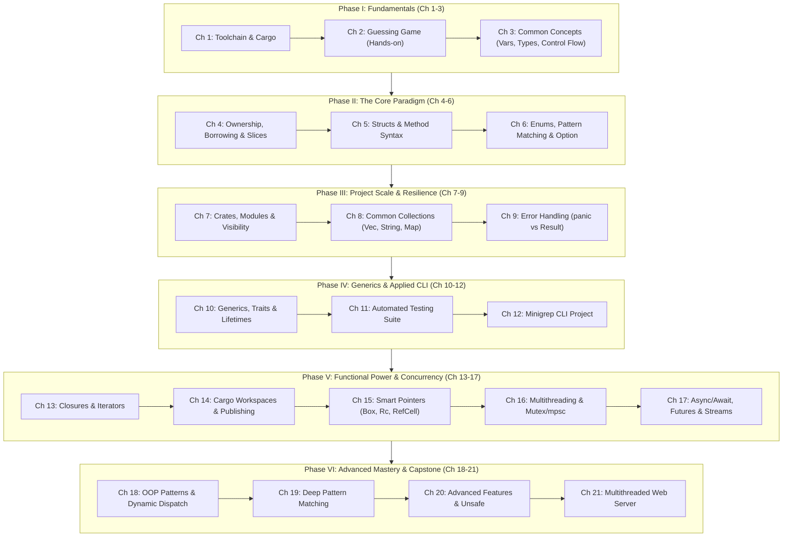
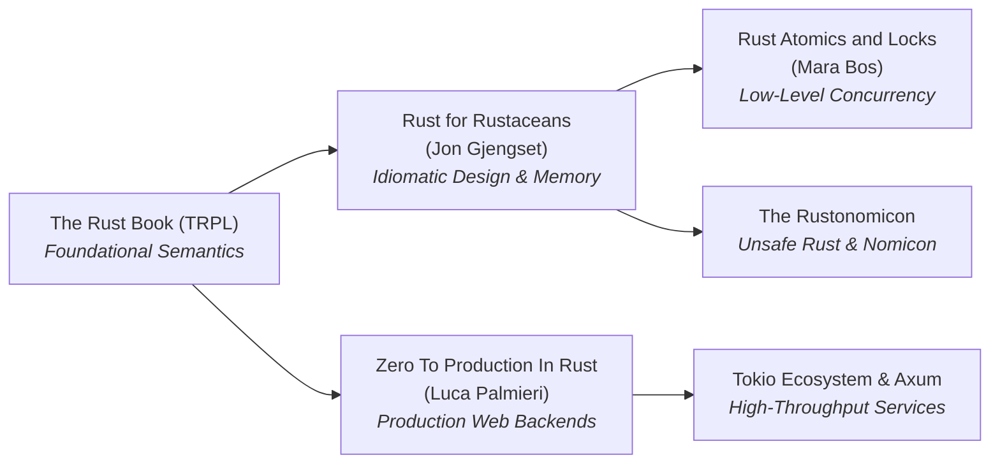

# Comprehensive Architectural Analysis: The Official Rust Book
*A Systems Programmer's & Educator's Deep Dive into "The Rust Programming Language" (TRPL)*

---

## 1. Executive Overview & Pedagogical Philosophy

"The Rust Programming Language" (colloquially known as *The Book* / TRPL) by Steve Klabnik, Carol Nichols, and the Rust Community is the definitive canonical entry point into the Rust ecosystem.

Unlike traditional systems programming manuals that treat language semantics and memory safety as orthogonal disciplines, TRPL weaves memory safety, type theory, and compiler diagnostics into a unified pedagogical narrative.

```
       ┌─────────────────────────────────────────────────────────┐
       │                   The TRPL Philosophy                   │
       ├────────────────────────────┬────────────────────────────┤
       │   1. Compiler as Tutor     │  Compiler errors are not   │
       │                            │  roadblocks; they are free │
       │                            │  interactive code reviews. │
       ├────────────────────────────┼────────────────────────────┤
       │   2. Affine Type Systems   │  Ownership and Borrowing   │
       │      Made Intuitive        │  explained via real-world  │
       │                            │  spatial/possession logic. │
       ├────────────────────────────┼────────────────────────────┤
       │   3. Zero-Cost             │  High-level ergonomics     │
       │      Abstractions          │  without sacrificing raw   │
       │                            │  metal performance.        │
       └────────────────────────────┴────────────────────────────┘
```

---

## 2. Macro Structure: The 6 Learning Phases

The 21 chapters of the modern Rust Book are structured into six progressive phases of systems mastery:



---

## 3. Chapter-by-Chapter In-Depth Technical Breakdown

---

### Phase I: Language Foundations (Chapters 1 – 3)
*Current Status: Completed*

#### Chapter 1: Getting Started
- **Core Topics**: `rustup`, `rustc`, `cargo new/build/run/check`, Edition concept.
- **Mental Model**: Cargo as an integrated build orchestrator, dependency manager, and testing runner. `cargo check` vs `cargo build` (skipping code generation during iterative development).
- **Key Takeaway**: Fast compile loops start with `cargo check`.

#### Chapter 2: Programming a Guessing Game
- **Core Topics**: `std::io`, standard prelude, type inference, mutability (`mut`), crates (`rand`), `match` expressions, shadowing for type parsing.
- **Mental Model**: Practical end-to-end Rust workflow before formal grammar rules are introduced.

#### Chapter 3: Common Programming Concepts
- **Core Topics**: Immutability vs Constants (`const`), variable shadowing (re-binding vs mutation), scalar & compound types (tuples, arrays), statements vs expressions, control flow (`if` expressions, `loop`, `while`, `for`).
- **Mental Model**: *Expression-oriented architecture*. In Rust, almost everything evaluates to a value (`let x = if c { 1 } else { 2 };`).
- **Memory Perspective**: Stack allocations for fixed-size primitives; arrays have fixed compile-time size `[T; N]`.

---

### Phase II: The Core Value Proposition (Chapters 4 – 6)

```
                     ┌────────────────────────────────────────┐
                     │          The Holy Grail of Rust        │
                     │         "Aliasing XOR Mutability"       │
                     └───────────────────┬────────────────────┘
                                         │
                 ┌───────────────────────┴───────────────────────┐
                 ▼                                               ▼
     ┌────────────────────────┐                     ┌────────────────────────┐
     │ Many Shared References │                     │ Exactly One Exclusive  │
     │      (&T, &T, ...)     │                     │     Reference (&mut T) │
     │       Read-Only        │                     │       Read-Write       │
     └────────────────────────┘                     └────────────────────────┘
                 │                                               │
                 └───────────────────────┬───────────────────────┘
                                         │
                                         ▼
                     ┌────────────────────────────────────────┐
                     │     Guarantees: Zero Data Races        │
                     │     No Iterator Invalidation           │
                     │     No Use-After-Free                  │
                     └────────────────────────────────────────┘
```

#### Chapter 4: Understanding Ownership (The Pivotal Chapter)
- **Subsections**:
  - `4.1 What is Ownership?` (Stack vs Heap, RAII, Move semantics, Drop trait)
  - `4.2 References and Borrowing` (Shared `&T` vs Mutable `&mut T` borrows, borrowing rules)
  - `4.3 The Slice Type` (`&str`, `&[T]`, fat pointers containing pointer + length)
- **Key Mental Models**:
  1. **Move Semantics vs Copy**: Types implementing `Copy` (all stack, e.g., `i32`) replicate bits on assignment; non-`Copy` types (e.g., `String`, `Vec`) transfer ownership, invalidating the source binding at compile-time.
  2. **Non-Lexical Lifetimes (NLL)**: References live from where they are defined until their *last usage*, not strictly the enclosing curly brace.
  3. **Fat Pointers**: A slice `&str` or `&[u8]` is a 2-word struct `(data_ptr: *const u8, len: usize)`.
- **Code Pattern & Idiom**:
  ```rust
  fn first_word(s: &str) -> &str {
      let bytes = s.as_bytes();
      for (i, &item) in bytes.iter().enumerate() {
          if item == b' ' {
              return &s[0..i];
          }
      }
      &s[..]
  }
  ```
- **Common Compiler Gotchas**:
  - `E0382`: Use of moved value.
  - `E0502`: Cannot borrow `*x` as mutable because it is also borrowed as immutable.
- **Study Strategy**: Write minimal code samples that deliberately violate ownership rules. Read the compiler error messages word-for-word.

---

#### Chapter 5: Using Structs to Structure Related Data
- **Subsections**:
  - `5.1 Defining and Instantiating Structs` (Field init shorthand, struct update syntax)
  - `5.2 An Example Program Using Structs` (`#[derive(Debug)]`, `dbg!` macro)
  - `5.3 Method Syntax` (`self`, `&self`, `&mut self`, associated functions)
- **Key Mental Models**:
  - Method receiver ownership: `&self` (inspect), `&mut self` (mutate in-place), `self` (consume / state transition).
  - Associated functions (e.g., `Rectangle::square(size)`) act as constructors without special `new` keywords.
- **Code Pattern**:
  ```rust
  #[derive(Debug, PartialEq, Clone)]
  struct Rectangle {
      width: u32,
      height: u32,
  }

  impl Rectangle {
      // Associated constructor
      fn new(width: u32, height: u32) -> Self {
          Self { width, height }
      }
      
      // Immutable borrow receiver
      fn area(&self) -> u32 {
          self.width * self.height
      }
      
      // Consuming receiver (builder / conversion)
      fn into_square(self) -> Self {
          let max_side = self.width.max(self.height);
          Self { width: max_side, height: max_side }
      }
  }
  ```

---

#### Chapter 6: Enums and Pattern Matching
- **Subsections**:
  - `6.1 Defining an Enum` (Data-bearing variants, `Option<T>` replacing `null`)
  - `6.2 The match Control Flow Construct` (Exhaustiveness checking, binding patterns)
  - `6.3 Concise Control Flow with if let and let...else`
- **Key Mental Models**:
  - **Algebraic Data Types (Sum Types)**: An `enum` variant can contain arbitrary disparate data types, tagged under a single discriminant.
  - **The Billion Dollar Mistake Solved**: Rust has no `null`/`nil`. Absence is an explicit type `Option<T> = Some(T) | None`.
- **Code Pattern**:
  ```rust
  enum WebEvent {
      PageLoad,
      KeyPress(char),
      Click { x: i64, y: i64 },
      Paste(String),
  }

  fn process_event(event: WebEvent) {
      match event {
          WebEvent::PageLoad => println!("Loaded"),
          WebEvent::KeyPress(c) => println!("Key: {c}"),
          WebEvent::Click { x, y } => println!("Clicked at ({x}, {y})"),
          WebEvent::Paste(ref text) => println!("Pasted: {text}"),
      }
  }
  ```

---

### Phase III: Engineering Scale, Collections & Safety (Chapters 7 – 9)

#### Chapter 7: Managing Growing Projects with Packages, Crates, and Modules
- **Subsections**:
  - `7.1 Packages and Crates` (Binary vs Library roots: `src/main.rs`, `src/lib.rs`)
  - `7.2 Defining Modules to Control Scope and Privacy` (`mod`, `pub`, `pub(crate)`)
  - `7.3 Paths for Referring to an Item in the Module Tree` (`crate::`, `super::`, `self::`)
  - `7.4 Bringing Paths into Scope with the use Keyword` (`use`, `pub use` re-exporting)
  - `7.5 Separating Modules into Different Files` (Modern Rust 2018+ module resolution without `mod.rs` requirement)
- **Key Mental Models**:
  - Modules form a tree hierarchy rooted at the crate root. Items are private by default to their parent.

---

#### Chapter 8: Common Collections
- **Subsections**:
  - `8.1 Vectors` (`Vec<T>`, amortized heap growth, reallocation invalidation)
  - `8.2 Strings` (`String` vs `&str`, UTF-8 byte representation, grapheme clusters vs scalar values)
  - `8.3 Hash Maps` (`HashMap<K, V>`, `Entry` API for ergonomic mutations)
- **Memory Layout Table**:

| Type | Stack Representation (64-bit) | Heap Representation |
| :--- | :--- | :--- |
| `Vec<T>` | `ptr (8B) \| cap (8B) \| len (8B)` (24 Bytes) | Contiguous buffer of `T` elements |
| `String` | `ptr (8B) \| cap (8B) \| len (8B)` (24 Bytes) | Valid UTF-8 encoded bytes |
| `&str` | `ptr (8B) \| len (8B)` (16 Bytes) | Borrowed slice of UTF-8 bytes |
| `&[T]` | `ptr (8B) \| len (8B)` (16 Bytes) | Borrowed slice of contiguous `T` |

- **Idiomatic Pattern (`Entry` API)**:
  ```rust
  use std::collections::HashMap;

  let text = "hello world wonderful world";
  let mut word_counts: HashMap<&str, u32> = HashMap::new();

  for word in text.split_whitespace() {
      *word_counts.entry(word).or_insert(0) += 1;
  }
  ```

---

#### Chapter 9: Error Handling
- **Subsections**:
  - `9.1 Unrecoverable Errors with panic!` (`panic!`, backtraces, stack unwinding vs abort)
  - `9.2 Recoverable Errors with Result` (`Result<T, E>`, `?` operator, `From` trait conversions)
  - `9.3 To panic! or Not to panic!` (Domain invariants vs user-recoverable errors)
- **Key Mental Model**:
  - Error propagation is explicit via `?`. The `?` operator automatically calls `From::from` to coerce underlying errors into the return type.
- **Code Pattern**:
  ```rust
  use std::fs::File;
  use std::io::{self, Read};

  fn read_username_from_file(path: &str) -> Result<String, io::Error> {
      let mut s = String::new();
      File::open(path)?.read_to_string(&mut s)?;
      Ok(s)
  }
  ```

---

### Phase IV: Abstractions, Lifetimes & Practical CLI (Chapters 10 – 12)

#### Chapter 10: Generic Types, Traits, and Lifetimes
- **Subsections**:
  - `10.1 Generic Data Types` (Functions, structs, enums, monomorphization)
  - `10.2 Traits: Defining Shared Behavior` (`impl Trait`, Trait Bounds, `where` clauses, conditional method implementation)
  - `10.3 Validating References with Lifetimes` (Generic lifetime annotations `'a`, Lifetime Elision Rules, Static lifetime `'static`)
- **Key Mental Models**:
  1. **Monomorphization**: Rust compiles generics into specialized concrete machine code per type with **zero runtime overhead**.
  2. **Lifetimes are Descriptive, Not Prescriptive**: Lifetime annotations do not change how long a value lives; they describe relationships between reference durations so the borrow checker can prove validity.
  3. **Lifetime Elision Rules**:
     - Rule 1: Each elided lifetime in parameters becomes a distinct lifetime parameter.
     - Rule 2: If there is exactly one input lifetime parameter, it is assigned to all elided output lifetimes.
     - Rule 3: If there are multiple input lifetime parameters and one is `&self` or `&mut self`, the lifetime of `self` is assigned to all elided output lifetimes.
- **Code Pattern**:
  ```rust
  // Trait definition with default implementation
  pub trait Summary {
      fn summarize_author(&self) -> String;
      
      fn summarize(&self) -> String {
          format!("(Read more from {}...)", self.summarize_author())
      }
  }

  // Lifetime annotation linking input reference to output reference
  fn longest<'a>(x: &'a str, y: &'a str) -> &'a str {
      if x.len() > y.len() { x } else { y }
  }
  ```

---

#### Chapter 11: Writing Automated Tests
- **Subsections**:
  - `11.1 How to Write Tests` (`#[test]`, `assert!`, `assert_eq!`, `#[should_panic]`, `Result<T, E>` in tests)
  - `11.2 Controlling How Tests Are Run` (`cargo test -- --test-threads=1`, `cargo test -- --nocapture`)
  - `11.3 Test Organization` (Unit tests in `src/` under `#[cfg(test)]` vs Integration tests in `tests/` directory)

---

#### Chapter 12: An I/O Project: Building a Command Line Program (`minigrep`)
- **Subsections**:
  - `12.1 Accepting Command Line Arguments` (`std::env::args`)
  - `12.2 Reading a File` (`std::fs::read_to_string`)
  - `12.3 Refactoring to Improve Modularity and Error Handling` (Separating `main.rs` and `lib.rs`, `Config::build`)
  - `12.4 Adding Functionality with Test-Driven Development (TDD)`
  - `12.5 Working with Environment Variables` (`std::env::var("IGNORE_CASE")`)
  - `12.6 Writing to Stderr Instead of Stdout` (`eprintln!`)
- **Pedagogical Significance**: This is the first milestone where ownership, error handling, struct methods, trait bounds, and I/O converge into a maintainable UNIX utility.

---

### Phase V: Functional Rust, Memory Control & Concurrency (Chapters 13 – 17)

#### Chapter 13: Functional Language Features: Iterators and Closures
- **Subsections**:
  - `13.1 Closures` (Environment capture: `Fn`, `FnMut`, `FnOnce`, `move` closures)
  - `13.2 Iterators` (`Iterator` trait, consuming adaptors e.g., `sum`, iterator adaptors e.g., `map`, `filter`)
  - `13.3 Improving Our I/O Project` (Refactoring `minigrep` to use zero-cost iterators instead of index slicing)
  - `13.4 Comparing Performance: Loops vs. Iterators` (Zero-cost abstractions benchmarked)
- **Key Mental Models**:
  - Closure Trait Hierarchy:
    - `FnOnce`: Can be called at least once (consumes captured variables).
    - `FnMut`: Can be called multiple times, can mutate captured state.
    - `Fn`: Can be called multiple times without mutating captured state (concurrently callable).

---

#### Chapter 14: More About Cargo and Crates.io
- **Subsections**:
  - `14.1 Customizing Builds with Release Profiles` (`[profile.dev]`, `[profile.release]`, `opt-level`)
  - `14.2 Publishing a Crate to Crates.io` (Doc comments `///`, documentation tests, `pub use` re-exports)
  - `14.3 Cargo Workspaces` (Multi-package mono-repos with shared `Cargo.lock`)
  - `14.4 Installing Binaries with cargo install`
  - `14.5 Extending Cargo with Custom Commands`

---

#### Chapter 15: Smart Pointers (Memory Deep Dive)
- **Subsections**:
  - `15.1 Using Box<T> to Point to Data on the Heap` (Recursive types, explicit heap allocation)
  - `15.2 Treating Smart Pointers Like Regular References with Deref` (`Deref`, `DerefMut`, Deref Coercion)
  - `15.3 Running Code on Cleanup with Drop` (Deterministic destruction, `std::mem::drop`)
  - `15.4 Rc<T>, the Reference Counted Smart Pointer` (Single-threaded multiple ownership)
  - `15.5 RefCell<T> and the Interior Mutability Pattern` (Dynamic borrow checking at runtime)
  - `15.6 Reference Cycles Can Leak Memory` (`Weak<T>`, preventing cyclic memory leaks)
- **Mental Model Comparison Table**:

| Smart Pointer | Ownership Model | Borrow Checking | Thread Safe? | Typical Use Case |
| :--- | :--- | :--- | :--- | :--- |
| `Box<T>` | Single Owner | Compile-time | Yes (if `T: Send`) | Recursive types, large heap structures, trait objects |
| `Rc<T>` | Multiple Owners | Compile-time | **No** | Shared read-only graphs in single-threaded contexts |
| `Arc<T>` | Multiple Owners | Compile-time | **Yes** (Atomic ref count) | Shared read-only data across threads |
| `RefCell<T>` | Single Owner | **Runtime** (`borrow()`, `borrow_mut()`) | **No** | Interior mutability inside immutable wrappers (`Rc<RefCell<T>>`) |
| `Mutex<T>` / `RwLock<T>` | Mutual Exclusion | **Runtime** lock acquisition | **Yes** | Shared mutable state across threads |

---

#### Chapter 16: Fearless Concurrency
- **Subsections**:
  - `16.1 Using Threads to Run Code Simultaneously` (`thread::spawn`, `JoinHandle`, `move` closures)
  - `16.2 Transfer Data Between Threads with Message Passing` (`mpsc::channel`, producer/consumer)
  - `16.3 Shared-State Concurrency` (`Arc<Mutex<T>>`, locking mechanisms, deadlock prevention)
  - `16.4 Extensible Concurrency with Send and Sync Traits`
- **Key Invariant**:
  - `Send`: Indicates ownership of the type can be transferred across thread boundaries.
  - `Sync`: Indicates it is safe to share references (`&T`) between threads (`T: Sync <=> &T: Send`).
  - Almost all primitive types are `Send + Sync`. Raw pointers (`*const T`, `*mut T`) and `Rc<T>` are neither.

---

#### Chapter 17: Fundamentals of Asynchronous Programming (Modern Rust Book Addition)
- **Subsections**:
  - `17.1 Futures and the Async Syntax` (`async`, `.await`, `Future` trait)
  - `17.2 Applying Concurrency with Async` (Cooperative multitasking vs OS threads)
  - `17.3 Working with Any Number of Futures` (`join!`, `select!`, race conditions)
  - `17.4 Streams: Futures in Sequence` (Asynchronous iterators)
  - `17.5 A Closer Look at the Traits for Async` (`Future::poll`, `Pin<&mut Self>`, `Context`, `Waker`)
  - `17.6 Futures, Tasks, and Threads` (When to use OS threads vs Green tasks/async runtimes)
- **Key Mental Models**:
  - **Pull-Based Futures**: Rust Futures are **lazy**; they do nothing unless actively polled by an executor.
  - **Zero-Allocation State Machines**: The compiler transforms an `async fn` into an anonymous enum state machine representing every `.await` suspension point.

---

### Phase VI: Advanced Ergonomics, System-Level Features & Capstone (Chapters 18 – 21)

#### Chapter 18: Object-Oriented Programming Features
- **Subsections**:
  - `18.1 Characteristics of Object-Oriented Languages` (Encapsulation, polymorphism)
  - `18.2 Using Trait Objects to Abstract over Shared Behavior` (`dyn Trait`, dynamic dispatch, vtable pointer)
  - `18.3 Implementing an Object-Oriented Design Pattern` (State pattern in OOP style vs idiomatic Rust Typestate pattern)
- **Mental Model: Static vs Dynamic Dispatch**:
  - Static: `fn draw(x: impl Draw)` $\rightarrow$ Monomorphized, inlineable, zero runtime overhead.
  - Dynamic: `fn draw(x: &dyn Draw)` $\rightarrow$ Fat pointer `(data_ptr, vtable_ptr)`, runtime indirection.

---

#### Chapter 19: Patterns and Matching
- **Subsections**:
  - `19.1 All the Places Patterns Can Be Used` (`match`, `if let`, `while let`, `for`, `let`, function parameters)
  - `19.2 Refutability: Whether a Pattern Might Fail to Match` (Irrefutable vs Refutable)
  - `19.3 Pattern Syntax` (Literals, named variables, multiple patterns `|`, ranges `..=`, destructuring structs/enums/tuples, ignoring values `_`, match guards `if`, bindings `@`)

---

#### Chapter 20: Advanced Features
- **Subsections**:
  - `20.1 Unsafe Rust` (Dereferencing raw pointers, calling unsafe functions/methods, implementing unsafe traits, mutating mutable static variables, accessing union fields)
  - `20.2 Advanced Traits` (Associated types vs generics, Operator overloading, Fully Qualified Syntax `<Type as Trait>::function`, Supertraits, Newtype pattern)
  - `20.3 Advanced Types` (Type aliases, The Never Type `!`, Dynamically Sized Types `str`, `[T]` and `Sized` trait)
  - `20.4 Advanced Functions and Closures` (Function pointers `fn`, returning closures)
  - `20.5 Macros` (Declarative `macro_rules!` vs Procedural Macros: custom derive, attribute-like, function-like)

---

#### Chapter 21: Final Project: Building a Multithreaded Web Server
- **Subsections**:
  - `21.1 Building a Single-Threaded Web Server` (`TcpListener`, HTTP parsing, HTML serving)
  - `21.2 From Single-Threaded to Multithreaded Server` (Designing a `ThreadPool` with worker threads and `mpsc` channel)
  - `21.3 Graceful Shutdown and Cleanup` (Implementing `Drop` for `ThreadPool`, sending explicit `Message::Terminate` signals)
- **Pedagogical Culmination**: Synthesizes smart pointers (`Arc`, `Mutex`), multithreading (`thread::spawn`), channels (`mpsc`), custom types, trait bounds, and RAII cleanup into a complete working network server from scratch using only `std`.

---

## 4. Critical Evaluation: TRPL Strengths vs Production Gaps

```
┌───────────────────────────────────────────────────────────────────────────────┐
│                           EVALUATION MATRIX: TRPL                             │
├───────────────────────────────────────┬───────────────────────────────────────┤
│          Where TRPL Excels            │     Where Production Gaps Exist       │
├───────────────────────────────────────┼───────────────────────────────────────┤
│ • Rock-solid mental models for memory │ • Real-world Async Ecosystem (Tokio)  │
│ • Clear Stack vs Heap mechanics       │ • Production Error Crates (anyhow)   │
│ • "Aliasing XOR Mutability" mastery   │ • Database I/O & Connection Pooling   │
│ • Demystifying compiler errors        │ • Production Architecture & Typestates│
│ • Zero-cost abstractions rationale    │ • Memory Layout, Alignment & SIMD     │
│ • Idiomatic standard library idioms   │ • Industrial Build Pipelines & FFI    │
└───────────────────────────────────────┴───────────────────────────────────────┘
```

### What TRPL Does Exceptionally Well

1. **Foundational Intuition for Memory Safety**:
   TRPL avoids abstract computer science jargon when introducing ownership. It grounds memory management in concrete terms: scopes, heap allocations, and drop mechanics.

2. **Compiler Diagnostic Literacy**:
   The book teaches readers how to interpret `rustc` compiler error outputs. It treats errors not as bugs, but as structural proofs of program safety.

3. **Progressive Unveiling (Pedagogical Flow)**:
   Concepts build naturally: scalar types $\rightarrow$ ownership $\rightarrow$ structs/enums $\rightarrow$ traits/lifetimes $\rightarrow$ smart pointers $\rightarrow$ concurrency.

4. **Fearless Concurrency Grounding**:
   By presenting `Send` and `Sync` as compile-time type system guarantees, TRPL removes the fear of multithreaded data races.

---

### Critical Production Gaps (What The Book Leaves Out)

While TRPL provides an exceptional foundation, real-world software engineering in Rust requires specialized tools and paradigms that the official book deliberately omits:

#### 1. The Real-World Async Runtime Ecosystem
- **The Gap**: TRPL introduces the fundamentals of `Future`, `poll`, and basic async syntax, but it intentionally does not cover production asynchronous runtimes like **Tokio** or **async-std**, nor web frameworks like **Axum** or **Actix-web**.
- **Real-World Need**: Industrial Rust services rely on Tokio for multi-threaded work-stealing schedulers, non-blocking I/O timers, actor-like message handling, and middleware integration via `tower`.

#### 2. Industrial Error Handling Disciplines
- **The Gap**: TRPL focuses on manual `Result<T, E>` and `match` / `?` matching with custom enums.
- **Real-World Need**:
  - **Domain / Library Errors**: Handled using `thiserror` for deriving clean `std::error::Error` implementations with minimal boilerplate.
  - **Application / Service Errors**: Handled using `anyhow` or `eyre` for dynamic error reporting with rich backtraces and attached context strings (`.context(...)`).

#### 3. Production Architecture: The Typestate Pattern & Newtypes
- **The Gap**: In Chapter 18, TRPL implements the OOP State Pattern using `Option<Box<dyn State>>`, which incurs runtime checks and heap indirection.
- **Real-World Need**: Production Rust uses the **Typestate Pattern** (encoding states into generic type parameters at compile-time) to enforce state machines at compile-time with zero runtime overhead.
  ```rust
  // Typestate Example: Invalid transitions are impossible at compile time!
  struct Draft;
  struct Published;

  struct Post<State> {
      content: String,
      _state: std::marker::PhantomData<State>,
  }

  impl Post<Draft> {
      fn new() -> Self { Post { content: String::new(), _state: std::marker::PhantomData } }
      fn add_text(&mut self, text: &str) { self.content.push_str(text); }
      fn publish(self) -> Post<Published> { Post { content: self.content, _state: std::marker::PhantomData } }
  }

  impl Post<Published> {
      fn display(&self) -> &str { &self.content }
  }
  ```

#### 4. Hardware-Level Memory Layout, Struct Alignment & Monomorphization
- **The Gap**: TRPL does not discuss struct padding, alignment, cache lines, SIMD, monomorphization code bloat, or analyzing emitted assembly via `cargo-show-asm`.
- **Real-World Need**: High-performance systems programming requires understanding `#[repr(C)]`, field ordering to minimize struct padding, and avoiding unconstrained generic monomorphization bloat.

#### 5. Database Interaction & Persistence
- **The Gap**: No coverage of SQL, relational modeling, connection pools, or ORMs.
- **Real-World Need**: Production backends use **SQLx** (for compile-time checked SQL queries) or **Diesel** / **SeaORM** for type-safe database access.

#### 6. FFI (Foreign Function Interface) & Build Automation
- **The Gap**: Raw pointers and `extern "C"` are touched briefly in Chapter 20, but practical C/C++ interop, `bindgen`, `cbindgen`, and `build.rs` automation scripts are not explored.

---

## 5. Strategic Study Plan & Execution Roadmap

To master Rust systematically, follow this tailored execution roadmap:

```
                                  STUDY ROADMAP
                                  
     [ You Are Here ]
            │
            ▼
┌───────────────────────┐
│   Phase 1: CH 4 - 6   │ ──► Master Ownership, Structs, Enums & Pattern Matching
└───────────┬───────────┘
            ▼
┌───────────────────────┐
│   Phase 2: CH 7 - 9   │ ──► Build Module discipline, Collections & Error Handling
└───────────┬───────────┘
            ▼
┌───────────────────────┐
│  Phase 3: CH 10 - 12  │ ──► Generics, Lifetimes, Automated Tests & Minigrep CLI
└───────────┬───────────┘
            ▼
┌───────────────────────┐
│  Phase 4: CH 13 - 15  │ ──► Closures, Iterators & Smart Pointer Memory Internals
└───────────┬───────────┘
            ▼
┌───────────────────────┐
│  Phase 5: CH 16 - 17  │ ──► Multithreading Concurrency & Modern Async/Await
└───────────┬───────────┘
            ▼
┌───────────────────────┐
│  Phase 6: CH 18 - 21  │ ──► Advanced Rust, Unsafe & Capstone Multithreaded Server
└───────────┬───────────┘
            ▼
┌───────────────────────┐
│  Beyond The Book:     │ ──► Tokio, Axum, SQLx, thiserror/anyhow, "Rust for Rustaceans"
│  Production Mastery   │
└───────────────────────┘
```

### Actionable Chapter Milestones

| Milestone | Chapter Focus | Practical Coding Objective | Mental Checkpoint |
| :--- | :--- | :--- | :--- |
| **Milestone 1** | Ch 4 (Ownership) | Implement custom string slice parsers and pass-by-reference functions | Can you explain why `let s2 = s1;` leaves `s1` uncallable? |
| **Milestone 2** | Ch 5 – 6 (Types) | Build a complete State Enum with methods and exhaustive pattern matches | Can you model domain states without using optional fields? |
| **Milestone 3** | Ch 7 – 9 (Modularity) | Build a multi-file library crate with `Result` error propagation | When should you use `panic!` vs returning a `Result`? |
| **Milestone 4** | Ch 10 – 12 (Generics & CLI) | Complete the `minigrep` CLI project with unit and integration tests | Explain the 3 Lifetime Elision rules without looking them up. |
| **Milestone 5** | Ch 13 – 15 (Pointers) | Build custom data structures (Tree/Graph) using `Rc<RefCell<Node>>` | Differentiate stack vs heap layouts for `Box`, `Rc`, and `RefCell`. |
| **Milestone 6** | Ch 16 – 17 (Concurrency) | Build a worker queue with `Arc<Mutex<T>>` and an async client | What makes a type `Send` vs `Sync`? |
| **Milestone 7** | Ch 18 – 21 (Capstone) | Complete the Multithreaded Web Server with graceful shutdown | How does `ThreadPool::drop` ensure zero thread leaks? |

---

## 6. Companion & Post-TRPL Reading Curriculum

To bridge the gap between TRPL and production-grade software engineering, consult the following curated literature:



1. **"Rust for Rustaceans" by Jon Gjengset**:
   *The* canonical intermediate-to-advanced text. Covers memory layout, unsafe code invariants, trait design patterns, and macro authoring.
2. **"Zero To Production In Rust" by Luca Palmieri**:
   Builds a complete, production-ready newsletter delivery system using Tokio, Actix/Axum, SQLx, Postgres, telemetry, and dockerized microservices.
3. **"Rust Atomics and Locks" by Mara Bos**:
   Master low-level concurrency, atomic operations, hardware memory ordering (`SeqCst`, `Acquire`/`Release`, `Relaxed`), and building custom synchronization primitives.
4. **"The Rustonomicon" (The Dark Arts of Unsafe Rust)**:
   The official guide to raw pointer manipulation, unchecked conversions, and undefined behavior invariants.

---
*Roadmap document generated for structured reference inside `/notes/roadmap/`.*
