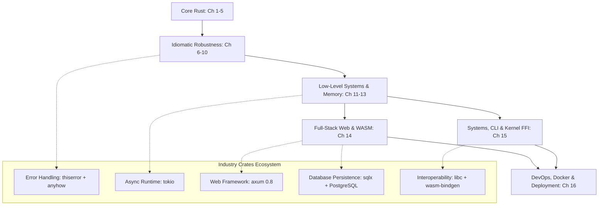
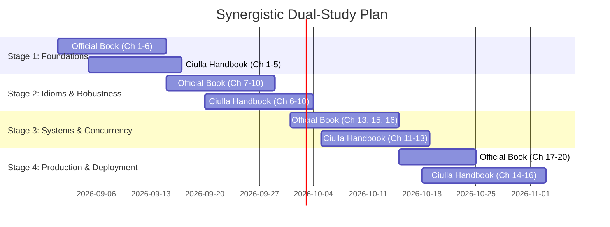

# The Rust Programming Handbook: Comprehensive Architecture & Pedagogical Breakdown

> **Book Title**: *The Rust Programming Handbook*  
> **Author**: Francesco Ciulla  
> **Publisher**: Packt Publishing (Late 2025 / 1st Edition)  
> **Target Audience**: Software Engineers, Backend Developers, and Systems Programmers transitioning to modern production Rust.  
> **Core Focus**: Pragmatic, industry-aligned Rust covering everything from core syntax to full-stack Web (Axum/Postgres/WASM), Systems Programming (FFI/Linux Kernel modules), and DevOps deployment (Multi-stage Docker, Compose, UPX).

---

## Table of Contents
1. [Executive Overview & Book Profile](#1-executive-overview--book-profile)
2. [The "Modern Rust Stack" Paradigm Shift](#2-the-modern-rust-stack-paradigm-shift)
3. [Chapter-by-Chapter Deep Dive (Ch 1 – 16)](#3-chapter-by-chapter-deep-dive-ch-1--16)
   - [Part I: Core Foundations & Language Mechanics (Ch 1–5)](#part-i-core-foundations--language-mechanics-ch-15)
   - [Part II: Robustness, Idioms & Design Patterns (Ch 6–10)](#part-ii-robustness-idioms--design-patterns-ch-610)
   - [Part III: Systems, Memory & Concurrency (Ch 11–13)](#part-iii-systems-memory--concurrency-ch-1113)
   - [Part IV: Production Applications, Web & Systems (Ch 14–16)](#part-iv-production-applications-web--systems-ch-1416)
4. [Comparative Matrix: Francesco Ciulla vs. The Official Rust Book](#4-comparative-matrix-francesco-ciulla-vs-the-official-rust-book)
5. [The Synergistic Dual-Curriculum Strategy](#5-the-synergistic-dual-curriculum-strategy)
6. [Conclusion & Actionable Next Steps](#6-conclusion--actionable-next-steps)

---

## 1. Executive Overview & Book Profile

Francesco Ciulla's *The Rust Programming Handbook* bridges a critical gap in the Rust literature: **the transition from theoretical syntax to production-grade engineering**. 

While canonical texts like *The Rust Programming Language* (the "Official Rust Book" by Steve Klabnik and Carol Nichols) focus deeply on language semantics, borrow-checker mechanics, and standard library fundamentals, Ciulla's handbook reflects modern **real-world Rust ecosystem practices as of 2025/2026**.

```
                           THE RUST LEARNING SPECTRUM
                           
   Theoretical Mechanics                                     Production Delivery
   (Language Spec / TRPL)                                    (Francesco Ciulla)
   ┌───────────────────────┐                                 ┌───────────────────────┐
   │ • Memory model & NLL  │                                 │ • Axum 0.8 Web API    │
   │ • Lifetime subtyping  │ ══════════════════════════════> │ • SQLx + PostgreSQL   │
   │ • Monomorphization    │    Pragmatic Synthesis Bridge   │ • thiserror / anyhow  │
   │ • std-only primitives │                                 │ • Multi-Stage Docker  │
   │ • Toy CLI / Grep      │                                 │ • Linux Kernel / FFI  │
   └───────────────────────┘                                 └───────────────────────┘
```

### Key Highlights
- **Direct Entry to Modern Crates**: Integrates de facto industry-standard crates (`thiserror`, `anyhow`, `tracing`, `tokio`, `axum`, `sqlx`, `wasm-bindgen`, `clap`, `libc`) directly into core topic discussions rather than treating them as external afterthoughts.
- **Full-Stack Rust**: Walks through building a full-stack REST service with Axum, connecting it asynchronously to PostgreSQL via SQLx with migrations, and building client-side WebAssembly (WASM) components.
- **End-to-End Delivery**: Dedicates entire chapters to FFI with C, Linux Kernel Module development, and DevOps pipelines (Docker multi-stage builds, Alpine/musl static linking, UPX compression, Docker Compose).

---

## 2. The "Modern Rust Stack" Paradigm Shift

In standard Rust education, learners often struggle to bridge the gap between finishing the Official Rust Book and writing production services. Francesco Ciulla organizes his book around the **Modern Rust Engineering Stack**:



---

## 3. Chapter-by-Chapter Deep Dive (Ch 1 – 16)

---

### Part I: Core Foundations & Language Mechanics (Ch 1–5)

#### Chapter 1: Getting Started with Rust
- **Core Topics**: Rust ecosystem overview, toolchain installation via `rustup`, Cargo package manager, `crates.io`, VS Code + `rust-analyzer` setup.
- **Key Project**: Building a CLI arithmetic calculator taking user input via `std::io::stdin()`.
- **Takeaway**: Immediate hands-on compilation; emphasizes why Rust provides memory safety without a garbage collector.

#### Chapter 2: Rust Syntax and Functions
- **Core Topics**: Mutability vs. immutability, variable shadowing, scalar types (`i8`–`i128`, `f32`/`f64`, `bool`, `char`), compound types (tuples, arrays), control flow (`if`/`else`, `loop`, `while`, `for` ranges), introduction to expressions vs. statements.
- **Idiomatic Pattern**: Expressions return values directly without explicit `return` keyword:
  ```rust
  let status = if score >= 50 { "Pass" } else { "Fail" };
  ```

#### Chapter 3: Functions in Rust
- **Core Topics**: Parameter passing, return types, pass-by-value vs. pass-by-reference at a functional level, divergent functions (`!`), functions taking closures as arguments.
- **Takeaway**: Explains how Rust functions enforce strict signature contracts at compile time.

#### Chapter 4: Ownership, Borrowing, and References
- **Core Topics**: Stack vs. Heap allocation, the Three Rules of Ownership, Move semantics, `Copy` trait vs. `Clone` trait, Borrowing rules (Aliasing XOR Mutability: $\text{Shared } \&T \lor \text{Exclusive } \&\text{mut } T$), Non-Lexical Lifetimes (NLL), Dangling reference prevention.
- **Memory Mental Model**:
  ```
  Stack [ptr | len | cap] ───> Heap ["Hello World" (bytes)]
  When ownership moves, the stack metadata is copied, and the source is invalidated!
  ```
- **Takeaway**: Explains how RAII (*Resource Acquisition Is Initialization*) automatically drops heap memory when owner goes out of scope without GC pauses.

#### Chapter 5: Composite Types in Rust and the Module System
- **Core Topics**: Structs (Named-field, Tuple structs, Unit-like structs), Struct update syntax (`..`), Enums with rich payload variants, `impl` blocks and methods vs. associated functions (`Self::new`), Module hierarchy (`mod`, `use`, `pub`, `pub(crate)`), Multi-file project organization.
- **Code Pattern: Enums with Variant Data**:
  ```rust
  enum WebEvent {
      PageLoad,
      KeyPress(char),
      Click { x: i64, y: i64 },
      Paste(String),
  }
  ```

---

### Part II: Robustness, Idioms & Design Patterns (Ch 6–10)

#### Chapter 6: Introduction to Error Handling
- **Core Topics**: Unrecoverable errors (`panic!`), Recoverable errors (`Option<T>`, `Result<T, E>`), the `?` propagation operator, combinator chains (`map`, `and_then`, `unwrap_or_else`), Custom error enums with `Display`/`Error` traits.
- **Modern Ecosystem**: Production error handling using `thiserror` for libraries and `anyhow` for applications:
  ```rust
  use thiserror::Error;

  #[derive(Error, Debug)]
  pub enum DataProcessingError {
      #[error("I/O error occurred: {0}")]
      Io(#[from] std::io::Error),
      
      #[error("Parse failure: {0}")]
      Parse(#[from] std::num::ParseIntError),
      
      #[error("Value out of valid range: {0}")]
      OutOfRange(i32),
  }
  ```
- **Architectural Rule of Thumb**:
  - Use `thiserror` when building libraries where consumers need strongly-typed variants to match against.
  - Use `anyhow` when building binary applications for easy error bubbling with context: `.context("Failed to load config file")`.

#### Chapter 7: Polymorphism and Lifetimes
- **Core Topics**: Ad-hoc polymorphism with Traits, Parametric polymorphism with Generics, Trait bounds (`T: Display + Clone`, `where` clauses), The Orphan Rule, Static dispatch (Monomorphization) vs. Dynamic dispatch (`dyn Trait` fat pointers with vtable), Explicit Lifetime Annotations (`'a`), Lifetime Elision Rules.
- **Hands-on Project**: Universal Media Player / Shape Drawing engine showcasing heterogeneous collections:
  ```rust
  pub trait Playable {
      fn play(&self);
  }

  // Dynamic dispatch via Boxed Trait Object
  let playlist: Vec<Box<dyn Playable>> = vec![
      Box::new(AudioFile { title: "track1.mp3".into() }),
      Box::new(VideoFile { title: "movie.mp4".into() }),
  ];
  for item in playlist {
      item.play();
  }
  ```

#### Chapter 8: Object-Oriented Programming in Rust
- **Core Topics**: How Rust approaches OOP principles: Encapsulation (structs + visibility), Polymorphism (traits), Composition over inheritance.
- **Design Patterns in Rust**:
  1. **Builder Pattern**: Fluent construction of complex structs with compile-time defaults.
  2. **State Pattern / Type-Driven State Machines**: Encoding lifecycle states into the type system to make invalid states unrepresentable at compile time:
     ```rust
     struct Draft;
     struct PendingReview;
     struct Published;

     struct Post<State> {
         content: String,
         state: State,
     }

     impl Post<Draft> {
         pub fn new(content: &str) -> Self {
             Post { content: content.to_string(), state: Draft }
         }
         pub fn request_review(self) -> Post<PendingReview> {
             Post { content: self.content, state: PendingReview }
         }
     }
     ```
  3. **Observer Pattern & Strategy Pattern**: Implementing decoupling using trait callbacks.

#### Chapter 9: Thinking Functionally in Rust
- **Core Topics**: Lazy Iterators (`Iterator` trait), Iteration mechanisms (`iter()` borrowed, `iter_mut()` mutable borrow, `into_iter()` owned consuming), Iterator Adapters (`map`, `filter`, `take`, `zip`, `enumerate`), Consumers (`collect`, `sum`, `fold`), Closures (`Fn`, `FnMut`, `FnOnce` capture modes), Pattern matching with match guards.
- **Assignment Project**: Custom Fibonacci sequence iterator implementing `Iterator` with `Item = u64`.

#### Chapter 10: Testing in Rust
- **Core Topics**: Unit tests (`#[test]`, `#[cfg(test)]`, `assert!`, `assert_eq!`, `should_panic`), Integration testing (in `tests/` directory with `tests/common/mod.rs` shared test helpers), Documentation tests (`///` doc comments tested via `cargo test`), Test-Driven Development (TDD) Red-Green-Refactor cycle.
- **Test Isolation**: Writing test doubles, stubs, and mocks using traits and dependency injection.

---

### Part III: Systems, Memory & Concurrency (Ch 11–13)

#### Chapter 11: Smart Pointers and Memory Management
- **Core Topics**: RAII (*Resource Acquisition Is Initialization*), `Box<T>` for heap indirection and recursive types (Cons-list / Trees), `Rc<T>` for single-threaded reference counting, `Arc<T>` for thread-safe atomic reference counting, Interior Mutability with `RefCell<T>` (runtime borrow checking), `Mutex<T>` / `RwLock<T>` (thread-safe synchronization), `Weak<T>` to break reference cycles and prevent memory leaks.
- **Complex Architecture Project**: Implementing a cyclic graph node network using `Rc<RefCell<Node>>` and `Weak<RefCell<Node>>`.

```
                SMART POINTER SELECTION MATRIX
                
             Single-Threaded             Multi-Threaded
         ┌─────────────────────────┬─────────────────────────┐
ReadOnly │ Box<T> / Rc<T>          │ Arc<T>                  │
         ├─────────────────────────┼─────────────────────────┤
Mutable  │ RefCell<T> / Rc<RefCell>│ Mutex<T> / Arc<Mutex<T>>│
         │                         │ RwLock<T> / Arc<RwLock> │
         └─────────────────────────┴─────────────────────────┘
```

#### Chapter 12: Managing System Resources
- **Core Topics**: File I/O (`std::fs::File`, `OpenOptions`, `BufReader`, `BufWriter` for buffered throughput), Line-by-line streaming vs. in-memory slurping, Network sockets (`std::net::TcpListener`, `TcpStream`), Echo servers, Error resilience, TLS encryption concepts.
- **Hands-on Projects**:
  1. CLI file copy utility with custom buffer chunks.
  2. In-memory Key-Value TCP store server handling basic protocol commands (`GET`, `SET`, `DEL`).

#### Chapter 13: Concurrency and Parallelism
- **Core Topics**: Native OS threads (`std::thread::spawn`), `move` closures for ownership transfer across thread boundaries, `JoinHandle::join()` and panic propagation, Shared state concurrency via `Arc<Mutex<T>>` and `Arc<RwLock<T>>`, Deadlock avoidance (lock ordering & minimizing critical sections), Message Passing Concurrency with `std::sync::mpsc` (Multiple Producer, Single Consumer channels).
- **Introduction to Async**: CPU-bound vs. I/O-bound workloads, Event loop architecture, Futures, `async`/`await` syntax, and async runtimes (`tokio`).
- **Assignment Project**: Multi-threaded concurrent file word counter using thread workers and channel aggregation.

---

### Part IV: Production Applications, Web & Systems (Ch 14–16)

#### Chapter 14: Rust for Web Development: Building Full-Stack Applications
- **Core Topics**: RESTful API design, modern web architecture with **Axum 0.8** & **Tokio**, Request Extractors (`Path`, `Query`, `Json`, `State`), Serde JSON serialization/deserialization, Middleware & CORS (`tower-http`).
- **Database Persistence**: PostgreSQL integration using **SQLx**:
  - Connection pooling with `sqlx::PgPool` injected into Axum `AppState`.
  - Database schema migrations using `sqlx-cli`.
  - Compile-time type-checked SQL queries / `#[derive(FromRow)]`.
- **WebAssembly (WASM) Frontend**:
  - Exporting Rust functions to the browser via `#[wasm_bindgen]`.
  - Building `.wasm` binaries and JavaScript glue code with `wasm-pack`.
  - Interacting with DOM elements from Rust in a browser client.

```rust
// Axum 0.8 + SQLx Persistence Example
#[derive(Clone)]
struct AppState {
    db: PgPool,
}

#[derive(Serialize, Deserialize, sqlx::FromRow)]
struct Todo {
    id: i32,
    title: String,
    completed: bool,
}

async fn get_todos(State(state): State<AppState>) -> Result<Json<Vec<Todo>>, StatusCode> {
    sqlx::query_as::<_, Todo>("SELECT id, title, completed FROM todos")
        .fetch_all(&state.db)
        .await
        .map(Json)
        .map_err(|_| StatusCode::INTERNAL_SERVER_ERROR)
}
```

#### Chapter 15: System Programming in Rust: Concrete Examples
- **Core Topics**: Low-level systems foundations, Stack vs. Heap explicit layouts, Raw pointers (`*const T`, `*mut T`), **The 5 Superpowers of `unsafe` Rust** (dereferencing raw pointers, calling unsafe functions/FFI, implementing unsafe traits, mutating mutable statics, accessing fields of `union`).
- **Production CLI Engineering**: Advanced CLI parsing, stdin/stdout/stderr streaming pipelines.
- **Foreign Function Interface (FFI) with C**:
  - Linking C libraries using `extern "C"` blocks and `build.rs` build scripts.
  - Converting C strings (`CString`, `CStr`) and handling primitive C type mappings (`libc`).
  - Wrapping unsafe C bindings inside safe, idiomatic Rust RAII wrappers.
- **Linux Kernel Module Development with Rust**:
  - Developing in `no_std` environments without runtime/allocator overhead.
  - Kernel module structure: `module!` macro, initialization and exit hooks, kernel logging (`pr_info!`).

#### Chapter 16: Dockerization and Deployment of Rust Applications
- **Core Topics**: Containerization strategies for compiled languages, why naive Rust Docker images are bloated (several GBs with cargo cache and source code).
- **Multi-Stage Docker Builds**:
  ```dockerfile
  # Stage 1: Build environment
  FROM rust:1.80-slim AS builder
  WORKDIR /app
  COPY Cargo.toml Cargo.lock ./
  # Dependency caching step
  RUN mkdir src && echo "fn main() {}" > src/main.rs && cargo build --release && rm -rf src
  COPY src ./src
  RUN cargo build --release

  # Stage 2: Minimal Runtime environment
  FROM debian:bookworm-slim AS runtime
  WORKDIR /app
  RUN apt-get update && apt-get install -y --no-install-recommends ca-certificates && rm -rf /var/lib/apt/lists/*
  COPY --from=builder /app/target/release/my_axum_app /app/my_axum_app
  EXPOSE 8080
  CMD ["./my_axum_app"]
  ```
- **Extreme Binary Optimization**:
  - Static compilation with `x86_64-unknown-linux-musl` targeting `scratch` or `alpine` (producing sub-15MB container images).
  - Stripping debug symbols (`strip --strip-all`).
  - Binary compression using **UPX** (*Ultimate Packer for eXecutables*).
- **Multi-Service Orchestration**:
  - Writing `compose.yml` coordinating Rust Axum web apps with PostgreSQL databases, environment variables, healthchecks, and persistent Docker volumes.
  - Publishing to container registries (Docker Hub / GitHub Container Registry `ghcr.io`).

---

## 4. Comparative Matrix: Francesco Ciulla vs. The Official Rust Book

| Evaluation Dimension | Francesco Ciulla's Handbook (Late 2025) | The Official Rust Book ("The Book" by Klabnik & Nichols) |
| :--- | :--- | :--- |
| **Primary Pedagogical Goal** | **Industry Readiness & Full-Stack Delivery** | **Foundational Language Mechanics & Compiler Semantics** |
| **Pacing & Tone** | Fast-paced, pragmatic, engineering-focused | Deliberate, methodical, conceptual |
| **Error Handling Approach** | Modern ecosystem: `thiserror` (libraries) + `anyhow` (applications) | Standard library only: manual `std::error::Error` & `From` impls |
| **Web Development** | **Complete Chapter (Ch 14)**: Axum 0.8 REST API, SQLx + Postgres, WASM frontend | Single toy single-threaded TCP HTTP server in final chapter |
| **Database & Persistence** | Real relational DB: **PostgreSQL + SQLx** async connection pooling & migrations | None (in-memory or basic file I/O only) |
| **DevOps & Deployment** | **Dedicated Chapter (Ch 16)**: Multi-stage Docker, Compose, Musl vs Glibc, UPX, Registries | None (out of scope for language manual) |
| **Low-Level Systems & FFI** | **Dedicated Chapter (Ch 15)**: C FFI with `build.rs`, raw pointers, Linux Kernel Module glimpse | Explains `unsafe` keywords and raw pointers theoretically |
| **Object-Oriented & Patterns** | Implements State Machine (Typed States), Builder, Observer, Strategy patterns | Discusses OOP differences and State Pattern using trait objects |
| **Testing** | Unit, Integration, Doc tests, **TDD cycles, Mocks & Stubs with traits** | Unit, Integration, and Doc tests basics |
| **Concurrency Model** | Threads, Mutex, Channels + **Async/Await & Tokio introduction** | Native OS Threads, Channels, Mutexes (`std::sync`) only |

---

## 5. The Synergistic Dual-Curriculum Strategy

To achieve true mastery in Rust, a learner should not pick one book over the other. Instead, use them **synergistically**: use the **Official Rust Book** to build deep mental models of the compiler, and use **Francesco Ciulla's Handbook** to translate those mechanics into production applications.



### Stage-by-Stage Reading Cross-Walk

```
┌────────────────────────────────────────┬────────────────────────────────────────┐
│ The Official Rust Book                 │ Francesco Ciulla's Handbook            │
│ (Deep Theory & Mental Models)          │ (Modern Tooling & Real-World Code)     │
├────────────────────────────────────────┼────────────────────────────────────────┤
│ STAGE 1: CORE SYNTAX & OWNERSHIP       │ STAGE 1: CORE SYNTAX & OWNERSHIP       │
│ • Ch 1-3: Setup, Types, Control Flow   │ • Ch 1-3: Quick syntax & CLI Calc      │
│ • Ch 4: Ownership & Borrowing (Deep)   │ • Ch 4: Memory layout & Move/Borrow    │
│ • Ch 5-6: Structs, Enums & Option      │ • Ch 5: Structs, Enums & Modules       │
├────────────────────────────────────────┼────────────────────────────────────────┤
│ STAGE 2: IDIOMS, GENERICS & ERRORS     │ STAGE 2: PRODUCTION ROBUSTNESS         │
│ • Ch 7-8: Modules & Collections        │ • Ch 6: thiserror + anyhow + logging   │
│ • Ch 9: Panic vs Result                │ • Ch 7: Applied Polymorphism project   │
│ • Ch 10: Generics, Traits, Lifetimes   │ • Ch 8: Type-driven State Pattern      │
│ • Ch 11: Automated Testing             │ • Ch 9-10: Functional Iterators & TDD  │
├────────────────────────────────────────┼────────────────────────────────────────┤
│ STAGE 3: MEMORY & MULTITHREADING       │ STAGE 3: SYSTEMS & MULTITHREADING      │
│ • Ch 13: Functional Features           │ • Ch 11: Smart pointers (Graph model)  │
│ • Ch 15: Smart Pointers (Box, Rc, Ref) │ • Ch 12: File I/O & TCP Key-Value App  │
│ • Ch 16: Fearless Concurrency          │ • Ch 13: Threads, Mutex, mpsc & Tokio  │
├────────────────────────────────────────┼────────────────────────────────────────┤
│ STAGE 4: ADVANCED TOPICS & DELIVERY    │ STAGE 4: FULL-STACK & DEVOPS           │
│ • Ch 17: OOP Features of Rust          │ • Ch 14: Axum Web API + SQLx + WASM    │
│ • Ch 18: Patterns and Matching         │ • Ch 15: C FFI, CLI & Linux Kernel     │
│ • Ch 19: Advanced Features (Unsafe)    │ • Ch 16: Multi-Stage Docker & Compose  │
│ • Ch 20: Final Project (Toy Web Server)│                                        │
└────────────────────────────────────────┴────────────────────────────────────────┘
```

---

## 6. Conclusion & Actionable Next Steps

Francesco Ciulla's *The Rust Programming Handbook* represents the modern standard for practical Rust learning. By moving beyond pure language syntax to include **Axum**, **SQLx**, **WebAssembly**, **Docker**, **thiserror/anyhow**, and **Linux Kernel / FFI**, it gives engineers the complete toolkit necessary to build, test, containerize, and deploy scalable Rust systems in production.

### Recommended Action Items for the User:
1. **Reference Document**: Keep this breakdown as your structured syllabus when advancing through the roadmap notes.
2. **Hands-on Milestones**: Implement each of the book's major milestone projects:
   - *Milestone 1*: Division & Data-pipeline error handling with `thiserror` + `anyhow` (Ch 6).
   - *Milestone 2*: Type-Driven State Machine for workflow lifecycles (Ch 8).
   - *Milestone 3*: Concurrent Word Counter using channels and worker threads (Ch 13).
   - *Milestone 4*: Axum + SQLx + Postgres REST API containerized with Docker Compose (Ch 14 & 16).
   - *Milestone 5*: Safe C FFI binding with custom `build.rs` (Ch 15).
