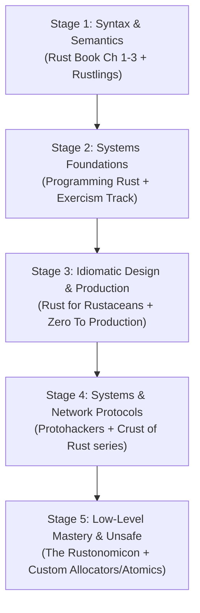
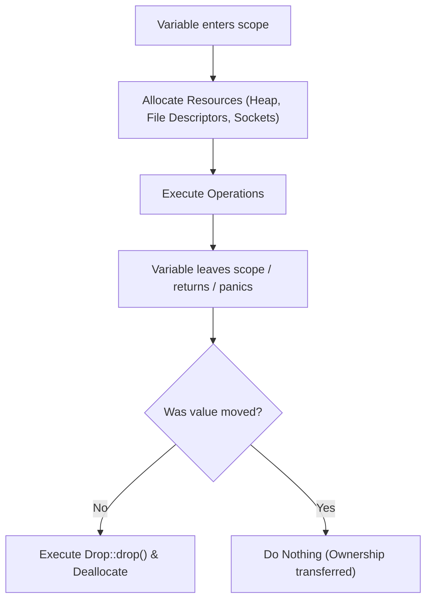
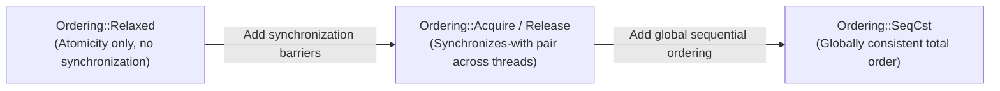
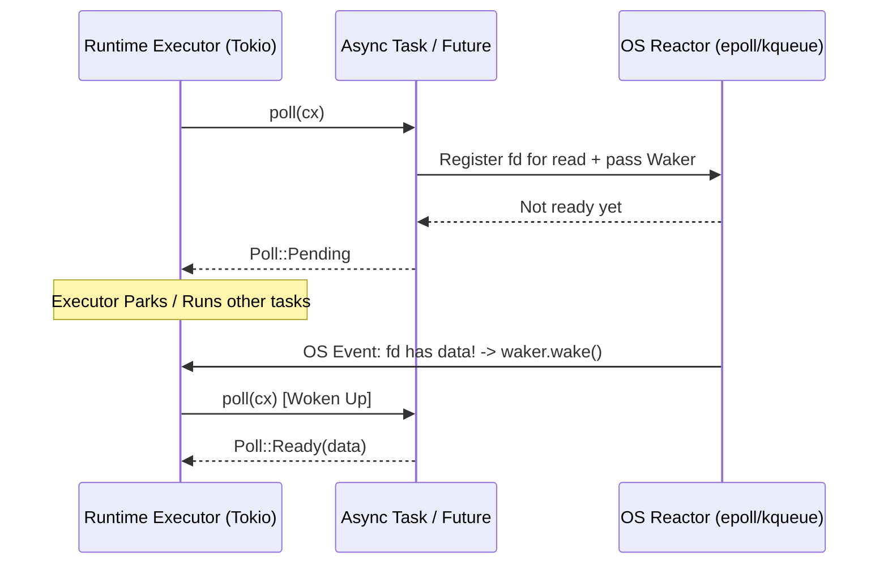

# 🦀 Rust Engineering Mastery: Advanced Resources, Mental Models & Systems Architecture

> **Author**: Principal Rust Systems Architect  
> **Target Audience**: Engineers transitioning from foundational syntax (Chapters 1–3) to production-grade, high-performance systems engineering.  
> **Scope**: Advanced literature critique, practical problem-solving platforms, low-level memory mechanics, concurrency invariants, async internals, and idiomatic systems design.

---

## Table of Contents
1. [The Paradigm Shift: From Syntax to Mechanical Sympathy](#1-the-paradigm-shift-from-syntax-to-mechanical-sympathy)
2. [Curated & Critiqued Learning Ecosystem](#2-curated--critiqued-learning-ecosystem)
   - [Deep-Dive Literature](#deep-dive-literature)
   - [Practice & Problem-Solving Platforms](#practice--problem-solving-platforms)
   - [Elite Video & Community Deep Dives](#elite-video--community-deep-dives)
   - [Curated Reading & Practice Progression Matrix](#curated-reading--practice-progression-matrix)
3. [Core Mental Model 1: The Low-Level Memory Model](#3-core-mental-model-1-the-low-level-memory-model)
   - [Stack Frames, Heap Allocations, and Lifecycles](#stack-frames-heap-allocations-and-lifecycles)
   - [Pointer Metadata: Thin vs. Fat Pointers](#pointer-metadata-thin-vs-fat-pointers)
   - [Memory Alignment, Padding, and `repr` Layouts](#memory-alignment-padding-and-repr-layouts)
   - [Sizedness & Dynamically Sized Types (`?Sized`, `str`, `[T]`, `dyn Trait`)](#sizedness--dynamically-sized-types-sized-str-t-dyn-trait)
   - [Drop Elaboration, RAII, and Drop Flags](#drop-elaboration-raii-and-drop-flags)
4. [Core Mental Model 2: Ownership, Lifetimes & Borrow Mechanics Under the Hood](#4-core-mental-model-2-ownership-lifetimes--borrow-mechanics-under-the-hood)
   - [The Borrow Checker as a Theorem Prover](#the-borrow-checker-as-a-theorem-prover)
   - [Non-Lexical Lifetimes (NLL) and Live Ranges](#non-lexical-lifetimes-nll-and-live-ranges)
   - [Reborrowing Semantics (`&mut *x`)](#reborrowing-semantics-mut-x)
   - [The Aliasing XOR Mutability Invariant](#the-aliasing-xor-mutability-invariant)
5. [Core Mental Model 3: Polymorphism, Monomorphization & Trait Objects](#5-core-mental-model-3-polymorphism-monomorphization--trait-objects)
   - [Static Dispatch vs. Dynamic Dispatch Trade-offs](#static-dispatch-vs-dynamic-dispatch-trade-offs)
   - [Monomorphization: Codegen, Inlining, and Cache Locality](#monomorphization-codegen-inlining-and-cache-locality)
   - [Dynamic Dispatch: Trait Objects and Vtable Mechanics](#dynamic-dispatch-trait-objects-and-vtable-mechanics)
   - [Object Safety Formal Rules](#object-safety-formal-rules)
6. [Core Mental Model 4: Concurrency, Parallelism & Memory Ordering](#6-core-mental-model-4-concurrency-parallelism--memory-ordering)
   - [The `Send` and `Sync` Auto-Trait Duality](#the-send-and-sync-auto-trait-duality)
   - [Atomics and the Hardware Memory Ordering Model](#atomics-and-the-hardware-memory-ordering-model)
   - [Lock-Free Concurrency, CAS Loops, and ABA Hazards](#lock-free-concurrency-cas-loops-and-aba-hazards)
   - [Thread Pools & Data Parallelism: Rayon's Work-Stealing](#thread-pools--data-parallelism-rayons-work-stealing)
7. [Core Mental Model 5: Async State Machines & Pinning Mechanics](#7-core-mental-model-5-async-state-machines--pinning-mechanics)
   - [Async Desugaring: Compiler-Generated State Machines](#async-desugaring-compiler-generated-state-machines)
   - [The Polling Protocol: `Future`, `Context`, `Waker`](#the-polling-protocol-future-context-waker)
   - [The Pinning Invariant (`Pin<P>`, `Unpin`, and `!Unpin`)](#the-pinning-invariant-pinp-unpin-and-unpin)
   - [Tokio Runtime Architecture & Cooperative Scheduling](#tokio-runtime-architecture--cooperative-scheduling)
8. [Core Mental Model 6: Industrial-Grade Error Handling Architecture](#8-core-mental-model-6-industrial-grade-error-handling-architecture)
   - [Library/Domain Errors (`thiserror`) vs. Application Errors (`anyhow`/`eyre`)](#librarydomain-errors-thiserror-vs-application-errors-anyhoweyre)
   - [Contextual Error Propagation and Zero-Cost Backtraces](#contextual-error-propagation-and-zero-cost-backtraces)
9. [Architectural Checklist for the Senior Rustacean](#9-architectural-checklist-for-the-senior-rustacean)

---

## 1. The Paradigm Shift: From Syntax to Mechanical Sympathy

Transitioning from a beginner who understands variable declarations and control flow to a principal systems engineer requires shifting your focus from **syntax** to **machine reality**.

```
+-------------------------------------------------------------------------------+
|                             LEVEL OF ABSTRACTION                              |
+-------------------------------------------------------------------------------+
| Level 1: Syntax & Types (Beginner)                                            |
|   -> "I declare a struct and write a loop."                                   |
+-------------------------------------------------------------------------------+
| Level 2: Ownership & Lifetime Compliance (Intermediate)                       |
|   -> "I appease the borrow checker by cloning or tweaking references."        |
+-------------------------------------------------------------------------------+
| Level 3: Mechanical Sympathy & Systems Architecture (Advanced / Principal)    |
|   -> "I understand stack/heap boundaries, memory alignment, cache lines,      |
|       atomic reordering, compiler monomorphization, and vtable layouts."      |
+-------------------------------------------------------------------------------+
```

A senior Rust engineer does not merely write code that compiles; they design systems that:
1. **Minimize cache misses and heap allocations** via deterministic memory layout.
2. **Prevent data races at compile time** via strict ownership and synchronization boundaries (`Send`/`Sync`).
3. **Exploit zero-cost abstractions** so high-level ergonomics compile down to optimal assembly.
4. **Enforce business invariants in the type system** (type-driven design / parse, don't validate).

---

## 2. Curated & Critiqued Learning Ecosystem

### Deep-Dive Literature

```
+------------------------------------+-------------------------------------+-----------------------------------+
| Book                               | Target Phase                        | Core Strengths                    |
+------------------------------------+-------------------------------------+-----------------------------------+
| Programming Rust (2nd Ed)          | Post-Basics (Chapters 4+)           | Deep systems mechanics & layout   |
| Rust for Rustaceans                | Intermediate -> Advanced            | Idiomatic API design & unsafe     |
| Zero To Production In Rust         | Intermediate Web/Backend            | Production engineering, telemetry |
| The Rustonomicon                   | Advanced / Unsafe                   | Subtyping, variance, aliasing     |
| Rust in Action                     | Intermediate Systems                | Hardware, CPU emulation, OS       |
| Command-Line Rust                  | Early Practice                      | Strict TDD CLI development        |
+------------------------------------+-------------------------------------+-----------------------------------+
```

#### 1. *Programming Rust, 2nd Edition* (Jim Blandy, Jason Orendorff, Leonora Tindall)
- **The Verdict**: The undisputed definitive systems manual for Rust.
- **Why it matters**: While *The Book* provides a gentle conceptual introduction, *Programming Rust* details the exact byte layouts, memory allocations, pointer indirection costs, and compiler transformations.
- **Key Chapters to Master**:
  - Chapter 5: References (Reborrowing, reference lifetimes in structs).
  - Chapter 9 & 10: Structs & Enums (Memory representation, niche optimization).
  - Chapter 11: Traits & Generics (Static vs. dynamic dispatch, associated types).
  - Chapter 19: Concurrency (Channels, locks, atomic operations).
  - Chapter 20: Asynchronous Programming (Custom futures, executor loops).
- **Critique**: Heavy and academic; do not read as your first book, but treat it as your primary reference when you need to know *what happens under the hood*.

#### 2. *Rust for Rustaceans* (Jon Gjengset)
- **The Verdict**: The masterclass for intermediate engineers seeking to write library-grade, idiomatic Rust.
- **Key Themes**:
  - **Memory Layout**: Struct field reordering, dynamically sized types (DSTs), alignment constraints.
  - **Designing Interfaces**: Ergonomic traits, extension traits, `AsRef`/`Borrow`/`Cow`, builder patterns.
  - **Unsafe Rust**: Undefined behavior (UB), invariants, provenance, pointer casting.
  - **Concurrency & Async**: Sync primitives, cancellation safety, task stealing.
- **Critique**: Expects you already know the syntax and basic borrow rules. It directly addresses the design trade-offs that senior engineers face daily.

#### 3. *Zero To Production In Rust* (Luca Palmieri)
- **The Verdict**: The gold standard for real-world backend engineering in Rust.
- **Key Themes**:
  - Enterprise web architecture using `actix-web` (and applicable to `axum`).
  - Database connectivity with compile-time checked SQL (`sqlx`).
  - Structured observability: tracing, logs, spans, and metrics.
  - Integration testing with isolated test harnesses and database migrations.
  - Cryptography, session management, and deployment pipelines.
- **Critique**: Highly opinionated around web services, but the architectural patterns (domain modeling, dependency injection via state, error handling) are universally applicable.

#### 4. *The Rustonomicon* ("The Dark Arts of Unsafe Rust")
- **The Verdict**: Mandatory reading before writing a single line of `unsafe`.
- **Key Themes**:
  - Aliasing rules and the stacked borrows / Tree Borrows model.
  - Variance (Covariance, Contravariance, Invariance) in lifetime and type parameters.
  - Drop check and uninitialized memory (`MaybeUninit<T>`).
  - Implementing custom collections (building a safe `Vec` from raw allocations).
- **Critique**: Brief and terse; it assumes a solid understanding of computer architecture and C-style memory pointers.

#### 5. *Rust in Action* (Tim McNamara)
- **The Verdict**: Systems programming fundamentals taught through Rust.
- **Key Themes**: Implementing a CHIP-8 CPU emulator, raw TCP/IP packet parsers, and custom storage engines.
- **Critique**: Great for engineers coming from high-level languages (Python/JS/Java) who need to build intuition for registers, endianness, and kernel system calls.

#### 6. *Command-Line Rust* (Ken Youens-Clark)
- **The Verdict**: Pragmatic test-driven development (TDD) for CLI tooling.
- **Key Themes**: Rebuilding standard Unix utilities (`cat`, `find`, `grep`, `cut`) using `clap`, `assert_cmd`, and `predicates`.

---

### Practice & Problem-Solving Platforms

```
+--------------------------+-----------------------------+----------------------------------------------+
| Platform                 | Ideal For                   | Key Skill Developed                          |
+--------------------------+-----------------------------+----------------------------------------------+
| Rustlings                | Syntax fluency (Day 1-14)   | Compiler error recognition & quick fixes     |
| Exercism (Rust Track)    | Idiomatic design (Day 15-45)| Mentored code reviews, functional patterns   |
| Advent of Code           | Algorithmic mastery         | Zero-allocation iterators, parsing, bitmasks |
| Protohackers             | Network Systems             | Raw TCP protocols, async streams, concurrency|
+--------------------------+-----------------------------+----------------------------------------------+
```

1. **Rustlings**: Quick drills to build muscle memory for compiler errors. Finish this immediately after reading Book chapters.
2. **Exercism (Rust Track)**: The best platform for learning idiomatic Rust because experienced mentors critique your solutions, pushing you toward zero-cost iterator chains, proper trait usage, and optimal allocations.
3. **Advent of Code**: Excellent for mastering iterator adaptors (`fold`, `flat_map`, `scan`, `partition`), `nom` / `winnow` parsing, and graph algorithms with arena allocators.
4. **Protohackers**: The ultimate test of systems and networking competency. You write servers adhering to strict raw TCP/UDP binary and text specifications (Echo, Prime Time, Budget Chat, Unusual Database, Speed Daemon). It forces you to deal with buffering, framing, packet reassembly, and high-concurrency connection pools.

---

### Elite Video & Community Deep Dives

1. **Jon Gjengset ("Crust of Rust" & Live Streams)**:
   - *Must-Watch Episodes*:
     - *Lifetimes and Subtyping*
     - *Smart Pointers and Interior Mutability (`Rc`, `Arc`, `RefCell`, `Mutex`)*
     - *Atomics and Memory Ordering*
     - *Channels (Building an MPMC lock-free channel from scratch)*
     - *Async / Await and Pinning*
     - *Dispatch and Fat Pointers*
2. **Amos Wenger (fasterthanli.me)**:
   - Renowned for exhaustive, bottom-up dissections of systems concepts (e.g., *"Making our own executable binaries"*, *"A name for every byte"*, *"I spent 3 weeks making a game in Rust"*). Explains every syscall and CPU instruction generated by Rust.
3. **Community & RFCs**:
   - *This Week in Rust*: Weekly tracking of language evolution, new crates, and engineering blog posts.
   - *Rust Internals Forum & RFC Repository*: Where the language is designed. Reading RFCs (such as RFC 2094 for Non-Lexical Lifetimes or RFC 2580 for Pointer Metadata) reveals *why* the language behaves the way it does.

---

### Curated Reading & Practice Progression Matrix



---

## 3. Core Mental Model 1: The Low-Level Memory Model

### Stack Frames, Heap Allocations, and Lifecycles

In Rust, every value has a deterministic memory representation and layout.

```
       STACK FRAME (Fast, LIFO, Fixed-size)              HEAP (Dynamic, Arbitrary Size)
+-----------------------------------------------+       +-------------------------------+
| Variable `v`: Vec<u32>                        |       | [0x1000] Heap Buffer          |
|  - ptr:  0x1000 ------------------------------+------>| [10, 20, 30, 40]              |
|  - cap:  4                                    |       | (4 * 4 bytes = 16 bytes)      |
|  - len:  4                                    |       +-------------------------------+
+-----------------------------------------------+
| Variable `slice`: &[u32] (Fat Pointer)         |
|  - ptr:  0x1008 ------------------------------+------> [30, 40] (Subslice of heap)
|  - len:  2                                    |
+-----------------------------------------------+
| Variable `val`: u64 = 42 (8 bytes inline)     |
+-----------------------------------------------+
```

- **The Stack**:
  - Memory allocated in contiguous LIFO frames per function invocation.
  - Stack allocation costs a single pointer increment (`sub rsp, N`).
  - Types placed on the stack **must have a size known at compile-time** (`Sized`).
- **The Heap**:
  - Memory requested at runtime from the system allocator (`jemalloc`, `mimalloc`, or system default).
  - Allocation involves finding a suitable free chunk, updating free lists, and handling fragmentation.
  - Heap-owning types (`Box<T>`, `Vec<T>`, `String`) store **fixed-size metadata on the stack** (pointer, capacity, length) and own memory on the heap.

---

### Pointer Metadata: Thin vs. Fat Pointers

Rust pointers come in two flavors: **Thin Pointers** (1 word = 8 bytes on 64-bit architectures) and **Fat Pointers** (2 words = 16 bytes).

```
1. Thin Pointer (e.g., &u32, &MyStruct, Box<i32>, *const u8):
   +-----------------------+
   | Pointer Address (8 B) |
   +-----------------------+

2. Fat Pointer: Slice (e.g., &[T], &str, *const [T]):
   +-----------------------+-----------------------+
   | Data Address (8 B)    | Element Count (8 B)   |
   +-----------------------+-----------------------+

3. Fat Pointer: Trait Object (e.g., &dyn Trait, Box<dyn Trait>):
   +-----------------------+-----------------------+
   | Data Address (8 B)    | Vtable Address (8 B)  |
   +-----------------------+-----------------------+
```

```rust
use std::mem::size_of;

trait Greeter {
    fn greet(&self);
}

struct User {
    id: u64,
}

impl Greeter for User {
    fn greet(&self) { println!("User {}", self.id); }
}

fn main() {
    // Thin pointers: size == 8 bytes (on 64-bit architecture)
    assert_eq!(size_of::<&User>(), 8);
    assert_eq!(size_of::<Box<User>>(), 8);
    assert_eq!(size_of::<*const User>(), 8);

    // Fat pointers: size == 16 bytes (pointer + length)
    assert_eq!(size_of::<&[u8]>(), 16);
    assert_eq!(size_of::<&str>(), 16);

    // Fat pointers: size == 16 bytes (pointer + vtable pointer)
    assert_eq!(size_of::<&dyn Greeter>(), 16);
    assert_eq!(size_of::<Box<dyn Greeter>>(), 16);
}
```

---

### Memory Alignment, Padding, and `repr` Layouts

CPUs access memory most efficiently when data types reside at memory addresses that are multiples of their natural alignment (e.g., a 4-byte `u32` at an address divisible by 4, an 8-byte `u64` at an address divisible by 8).

#### Struct Field Reordering (Default `repr(Rust)`)
Unlike C, the Rust compiler (`rustc`) automatically reorders struct fields to minimize padding waste.

```rust
// Naive declaration:
struct Unoptimized {
    a: u8,   // 1 byte
    b: u64,  // 8 bytes
    c: u16,  // 2 bytes
}
```

In C (`repr(C)`), this struct requires 24 bytes due to padding:
```
C Memory Layout:
| a (1B) | Pad (7B) | b (8B) | c (2B) | Pad (6B) | = 24 Bytes Total!
```

Under `repr(Rust)`, the compiler reorders fields by descending alignment:
```
Rust Memory Layout (Reordered):
| b (8B) | c (2B) | a (1B) | Pad (1B) | = 12 -> rounded to align 8 = 16 Bytes Total!
```

```rust
use std::mem::{size_of, align_of};

#[repr(C)]
struct CLayout {
    a: u8,
    b: u64,
    c: u16,
}

struct RustLayout {
    a: u8,
    b: u64,
    c: u16,
}

fn main() {
    assert_eq!(size_of::<CLayout>(), 24);
    assert_eq!(size_of::<RustLayout>(), 16);
    assert_eq!(align_of::<RustLayout>(), 8);
}
```

#### Key `repr` Attributes
- `#[repr(C)]`: Enforces C-compatible field layout (essential for FFI and binary wire protocols).
- `#[repr(transparent)]`: Guarantees that a single-field struct/newtype has the exact same memory layout and ABI as its inner type (zero runtime overhead wrapper).
- `#[repr(packed)]`: Strips all padding, aligning fields to 1 byte. **Warning**: Accessing unaligned references from packed structs is undefined behavior on architectures requiring strict alignment!
- `#[repr(align(N))]`: Forces alignment to at least $N$ bytes (useful for cache-line alignment to avoid false sharing in multithreaded systems, e.g., `#[repr(align(64))]`).

---

### Sizedness & Dynamically Sized Types (`?Sized`, `str`, `[T]`, `dyn Trait`)

In Rust, types whose sizes cannot be determined at compile time are called **Dynamically Sized Types (DSTs)** or **Unsized Types**.

Examples:
- `[T]`: A slice of unknown element count.
- `str`: A string slice of unknown byte length.
- `dyn Trait`: An unsized trait object.

#### The `Sized` Trait Bound
By default, **every generic parameter in Rust has an implicit `T: Sized` bound**:
```rust
fn print_val<T>(val: T) { ... }
// Desugars into:
fn print_val<T: Sized>(val: T) { ... }
```

To opt out of this requirement and accept DSTs, you must explicitly use the relaxed bound `?Sized`:
```rust
// Accepts both Sized types (e.g. String, i32) and DSTs (e.g. str, [u8]) via reference
fn print_slice<T: ?Sized>(val: &T) {
    // We can only hold `T` behind a pointer/reference (&T, Box<T>, Arc<T>)
    // because &T is a fat pointer with known size (16 bytes).
}
```

```
+-------------------+-----------------------------------+------------------------------------+
| Type              | Size known at compile-time?       | Can live directly on stack/by-val? |
+-------------------+-----------------------------------+------------------------------------+
| u32, [u8; 32]     | YES (`Sized`)                     | YES                                |
| str, [u8]         | NO (`?Sized` / DST)               | NO (Must be behind `&str`, `&[u8]`)|
| dyn Display       | NO (`?Sized` / DST)               | NO (Must be behind `&dyn Display`) |
+-------------------+-----------------------------------+------------------------------------+
```

---

### Drop Elaboration, RAII, and Drop Flags

Rust enforces **Resource Acquisition Is Initialization (RAII)**. When a value's owning scope terminates, its `Drop::drop` implementation executes automatically.



#### Drop Flags (Stack vs. Static)
When ownership is moved unconditionally, the compiler emits a direct drop call at the exit point:
```rust
{
    let v = vec![1, 2, 3];
    // Static drop elaboration: compiler inserts drop(v) right here.
}
```

When a move happens **conditionally** within branches, the compiler injects a hidden 1-byte boolean **drop flag** on the stack frame to track at runtime whether the destructor must run:
```rust
{
    let v = vec![1, 2, 3];
    if condition() {
        consume(v); // Move occurs here -> drop flag set to false
    }
    // At scope exit, compiler checks: `if drop_flag_for_v { drop(v); }`
}
```

---

## 4. Core Mental Model 2: Ownership, Lifetimes & Borrow Mechanics Under the Hood

### The Borrow Checker as a Theorem Prover

The Rust borrow checker is not an arbitrary linter; it is a **static theorem prover** that proves the absence of data races, dangling pointers, and iterator invalidation by proving that your code adheres to affine type semantics.

```
       +-------------------------------------------------------------+
       |             THE ALIASING XOR MUTABILITY AXIOM               |
       |                                                             |
       |   At any given point in program execution, for any value V: |
       |                                                             |
       |     Either: Multiple shared references (&T) exist           |
       |     XOR:    Exactly ONE exclusive reference (&mut T) exists |
       +-------------------------------------------------------------+
```

```
Shared (&T):      [Reader 1]   [Reader 2]   [Reader 3]  ==>  READ ONLY (Aliasing Allowed)
Exclusive (&mut): [Writer 1]                            ==>  READ + WRITE (Aliasing FORBIDDEN)
```

---

### Non-Lexical Lifetimes (NLL) and Live Ranges

Prior to the NLL borrow checker (2018 edition), lifetimes were strictly tied to their lexical syntactic scopes (`{ ... }`). Under modern NLL (Polonius/NLL), **a borrow's lifetime extends only to the last point where it is actively used**.

```rust
fn nll_demonstration() {
    let mut data = vec![1, 2, 3];

    let r1 = &data[0]; // Immutable borrow begins
    println!("Read: {r1}"); // Last use of r1! Borrow of r1 ENDS here.

    // ✅ In older Rust, this failed because lexical scope hadn't ended.
    // ✅ In modern NLL Rust, this succeeds because r1's live range is dead.
    data.push(4); // Exclusive mutable borrow succeeds!
}
```

```
Lexical Scope:   [===================================================]
r1 Live Range:   [=============] (Dead after println!)
data.push(4):                   [====] (Valid: No active borrows!)
```

---

### Reborrowing Semantics (`&mut *x`)

A common point of confusion is how mutable references can be passed into functions or loops without being consumed. When you pass an `&mut T` into another function, Rust does not *move* the reference; it performs an automatic **reborrow** (`&mut *ref`).

```rust
fn mutate(slice: &mut [i32]) {
    slice[0] += 1;
}

fn process(val: &mut Vec<i32>) {
    // Automatic reborrow: `mutate(&mut *val)`
    // The original `val` is temporarily suspended while the reborrow lives.
    mutate(val);
    
    // `val` is usable again once the child function returns!
    val.push(99);
}
```

During the lifetime of the reborrow, access through the parent reference is frozen. Once the reborrow's live range expires, access to the parent reference is restored.

---

### The Aliasing XOR Mutability Invariant

Why is this invariant so strictly enforced? Because **Aliasing + Mutation = Memory Corruption in Concurrent / Systems Code**.

```rust
// The Classic Iterator Invalidation Bug (Prevented at Compile-Time in Rust)
let mut vec = vec![1, 2, 3];

for item in &vec { // Shared borrow of `vec` begins
    if *item == 2 {
        // vec.push(42); 
        // ❌ COMPILE ERROR: cannot borrow `vec` as mutable because it is also borrowed as immutable.
        // Reason: `push` might reallocate the underlying heap buffer, 
        // leaving the iterator's `item` pointer dangling into deallocated memory!
    }
}
```

---

## 5. Core Mental Model 3: Polymorphism, Monomorphization & Trait Objects

Rust offers two distinct polymorphism strategies: **Static Dispatch** and **Dynamic Dispatch**.

```
+-----------------------+---------------------------------------+---------------------------------------+
| Attribute             | Static Dispatch (`impl Trait`, `<T>`) | Dynamic Dispatch (`dyn Trait`)        |
+-----------------------+---------------------------------------+---------------------------------------+
| Mechanism             | Monomorphization at compile-time      | Vtable pointer lookup at runtime      |
| Runtime Cost          | Zero indirection; full inlining       | Fat pointer indirection + call penalty|
| Binary Size           | Larger (code duplication per type)    | Smaller (single shared implementation)|
| Dynamic Collections   | Homogeneous collections only          | Heterogeneous collections supported   |
| Optimization          | LLVM performs cross-function inlining | Optimization across call site blocked |
+-----------------------+---------------------------------------+---------------------------------------+
```

### Monomorphization: Codegen, Inlining, and Cache Locality

When you write a generic function, the Rust compiler generates a distinct copy of machine code for every concrete type used.

```rust
fn print_hash<T: std::hash::Hash>(item: T) {
    // ...
}

// If invoked with i32 and String:
// rustc produces:
// 1. print_hash_i32(item: i32)
// 2. print_hash_string(item: String)
```

- **Pros**: The compiler knows the exact memory layout and addresses, enabling LLVM to inline functions, unroll loops, and eliminate dead code.
- **Cons**: Excessive monomorphization causes **binary bloat** and increases instruction cache (I-cache) pressure.

---

### Dynamic Dispatch: Trait Objects and Vtable Mechanics

When dynamic dispatch is chosen (`&dyn Trait` or `Box<dyn Trait>`), the compiler constructs a static **Virtual Method Table (Vtable)** for each type implementing the trait.

```
                  FAT POINTER (&dyn Trait)
         +--------------------+--------------------+
         |  Data Pointer (8B) | Vtable Pointer (8B)|
         +---------+----------+---------+----------+
                   |                    |
                   v                    v
         +------------------+  +--------------------------------+
         | Concrete Struct  |  | Vtable for Struct as Trait     |
         | { id: 42, ... }  |  | - Destructor fn pointer        |
         +------------------+  | - Size: 8 bytes                |
                               | - Alignment: 8 bytes           |
                               | - Method 1 fn pointer ---------> fn code in .text
                               | - Method 2 fn pointer ---------> fn code in .text
                               +--------------------------------+
```

```rust
trait Renderable {
    fn render(&self);
}

struct Button;
struct TextBox;

impl Renderable for Button {
    fn render(&self) { println!("<button/>"); }
}

impl Renderable for TextBox {
    fn render(&self) { println!("<input/>"); }
}

fn draw_ui(elements: &[Box<dyn Renderable>]) {
    // Heterogeneous collection enabled by dynamic dispatch
    for el in elements {
        el.render(); // Dereferences vtable pointer -> indirect call
    }
}
```

---

### Object Safety Formal Rules

A trait can be made into a trait object (`dyn Trait`) **if and only if it is object-safe**.

A trait is **object-safe** if:
1. **The trait does not require `Self: Sized`**:
   ```rust
   // ❌ NOT Object-Safe (cannot create `dyn NotSafe`)
   trait NotSafe: Sized {
       fn run(&self);
   }
   ```
2. **All associated methods meet the following criteria**:
   - Must not have generic type parameters:
     ```rust
     // ❌ NOT Object-Safe: vtable would need infinite entries for every possible T!
     trait BadGeneric {
         fn process<T>(&self, val: T);
     }
     ```
   - Must have a receiver that is a reference or smart pointer to `Self` (`&self`, `&mut self`, `Box<Self>`, `Rc<Self>`, `Arc<Self>`, `Pin<P>`):
     ```rust
     // ❌ NOT Object-Safe: Static/constructor method with no receiver
     trait BadConstructor {
         fn new() -> Self;
     }
     ```
   - Must not return `Self` by value (since `Self` is unsized behind `dyn Trait`).

#### Pro-Tip: Selectively Disabling Methods with `where Self: Sized`
You can keep a trait object-safe while providing helper or constructor methods by adding `where Self: Sized` to non-compliant methods:

```rust
trait Stream {
    fn next_chunk(&mut self) -> Option<Vec<u8>>; // ✅ Object-Safe method

    // ✅ Trait remains object-safe! `boxed` is excluded from the vtable:
    fn boxed(self) -> Box<Self>
    where
        Self: Sized,
    {
        Box::new(self)
    }
}
```

---

## 6. Core Mental Model 4: Concurrency, Parallelism & Memory Ordering

### The `Send` and `Sync` Auto-Trait Duality

In Rust, thread safety is modeled by two foundational, compiler-synthesized auto-traits:

$$\boxed{T: \text{Sync} \iff \&T: \text{Send}}$$

```
+-------------------+-----------------------------------------------------------------------------------+
| Trait             | Meaning                                                                           |
+-------------------+-----------------------------------------------------------------------------------+
| `Send`            | Safe to transfer ownership of `T` across thread boundaries.                      |
| `Sync`            | Safe to share references (`&T`) concurrently across multiple threads.            |
+-------------------+-----------------------------------------------------------------------------------+
```

```
+----------------------+-----------+-----------+--------------------------------------------------------+
| Type                 | Send?     | Sync?     | Reason / Safety Boundary                               |
+----------------------+-----------+-----------+--------------------------------------------------------+
| `i32`, `String`      | YES       | YES       | Plain data types with distinct ownership.              |
| `Rc<T>`              | NO        | NO        | Non-atomic reference counting (causes data races).     |
| `Arc<T>`             | YES       | YES       | Atomic reference counting (if `T: Send + Sync`).       |
| `RefCell<T>`         | YES       | NO        | Non-thread-safe runtime borrow checks.                |
| `Mutex<T>`           | YES       | YES       | Provides thread-safe mutual exclusion.                 |
| `*const T`, `*mut T` | NO        | NO        | Raw pointers have no compiler safety guarantees.       |
+----------------------+-----------+-----------+--------------------------------------------------------+
```

---

### Atomics and the Hardware Memory Ordering Model

Modern multi-core processors reorder memory operations for maximum pipeline efficiency. Rust provides explicit hardware memory orderings via `std::sync::atomic::Ordering`.



#### 1. `Ordering::Relaxed`
- Guarantees **atomicity** (no partial byte reads/writes), but **zero synchronization or ordering guarantees**.
- Other threads can see surrounding memory operations reordered.
- *Use Case*: Monotonic counters, telemetry metrics where ordering relative to other data is irrelevant.

#### 2. `Ordering::Release` and `Ordering::Acquire` (The Synchronizes-With Relationship)
- **Release (`store`)**: All memory writes made prior to this store are guaranteed to be visible to any thread that loads this variable with `Acquire`.
- **Acquire (`load`)**: Guarantees that subsequent memory reads cannot be reordered before this load.
- *Use Case*: Building mutexes, spinlocks, channels, and message queues.

```rust
use std::sync::atomic::{AtomicBool, AtomicU64, Ordering};
use std::sync::Arc;
use std::thread;

struct LockFreeMessage {
    data: AtomicU64,
    ready: AtomicBool,
}

fn producer_consumer_pattern() {
    let msg = Arc::new(LockFreeMessage {
        data: AtomicU64::new(0),
        ready: AtomicBool::new(false),
    });

    let producer_msg = Arc::clone(&msg);
    let producer = thread::spawn(move || {
        producer_msg.data.store(42, Ordering::Relaxed);
        // Release: Flushes the write to `data` before making `ready` true!
        producer_msg.ready.store(true, Ordering::Release);
    });

    let consumer_msg = Arc::clone(&msg);
    let consumer = thread::spawn(move || {
        // Acquire: Ensures when `ready` is true, `data` is guaranteed to be 42.
        while !consumer_msg.ready.load(Ordering::Acquire) {
            std::hint::spin_loop();
        }
        assert_eq!(consumer_msg.data.load(Ordering::Relaxed), 42);
    });

    producer.join().unwrap();
    consumer.join().unwrap();
}
```

#### 3. `Ordering::SeqCst` (Sequential Consistency)
- Enforces a single, globally visible total order of operations across all threads.
- Heaviest overhead on weakly-ordered architectures (ARM, POWER) as it emits full memory fences (`dmb ish` / `mfence`).

---

### Lock-Free Concurrency, CAS Loops, and ABA Hazards

Lock-free data structures rely on hardware **Compare-And-Swap (CAS)** instructions (`Atomic::compare_exchange` / `compare_exchange_weak`).

```rust
use std::sync::atomic::{AtomicUsize, Ordering};

pub struct LockFreeCounter {
    value: AtomicUsize,
}

impl LockFreeCounter {
    pub fn new(init: usize) -> Self {
        Self { value: AtomicUsize::new(init) }
    }

    pub fn increment(&self) -> usize {
        let mut current = self.value.load(Ordering::Relaxed);
        loop {
            let next = current + 1;
            // Attempt atomic swap if value hasn't changed in the meantime
            match self.value.compare_exchange_weak(
                current,
                next,
                Ordering::AcqRel,
                Ordering::Acquire,
            ) {
                Ok(old) => return old,
                Err(actual) => current = actual, // Retry with updated actual value
            }
        }
    }
}
```

#### The ABA Problem & Memory Reclamation
In pointer-based lock-free structures (e.g., lock-free stacks/queues), node address $A$ can be freed and reallocated at the same address $A$ while another thread is mid-CAS, causing corrupt pointer updates. Production systems resolve this using:
1. **Epoch-Based Reclamation** (`crossbeam-epoch`).
2. **Hazard Pointers**.

---

### Thread Pools & Data Parallelism: Rayon's Work-Stealing

For CPU-bound tasks, standard OS thread spawning incurs prohibitive context-switching and allocation costs. **Rayon** implements a work-stealing fork-join model based on deque queues per worker thread.

```
Thread Pool (Rayon Work-Stealing Architecture):
[Worker 1 Deque] -> [Task A] [Task B] [Task C] ---> Worker 1 executing Task A
[Worker 2 Deque] -> (Empty)                     ---> Worker 2 STEALS Task C from Worker 1's tail!
```

```rust
use rayon::prelude::*;

fn compute_parallel_sum(values: &[u64]) -> u64 {
    // Automatically subdivides slices across CPU cores with zero manual thread management
    values.par_iter().map(|&x| x * x).sum()
}
```

---

## 7. Core Mental Model 5: Async State Machines & Pinning Mechanics

### Async Desugaring: Compiler-Generated State Machines

In Rust, `async fn` does not run on a hidden green-thread runtime. Instead, **the compiler desugars the function into an anonymous enum representing a finite state machine**.

```rust
// Surface Syntax:
async fn fetch_and_process() -> u32 {
    let raw = fetch_data().await; // Suspension Point 1
    let parsed = parse_data(raw).await; // Suspension Point 2
    parsed + 1
}
```

The compiler transforms this into roughly:
```rust
enum FetchAndProcessStateMachine {
    Start,
    WaitingOnFetch { future: FetchDataFuture },
    WaitingOnParse { raw_data: String, future: ParseDataFuture },
    Done,
}

impl Future for FetchAndProcessStateMachine {
    type Output = u32;
    fn poll(mut self: Pin<&mut Self>, cx: &mut Context<'_>) -> Poll<Self::Output> {
        // State transition logic across yield points
    }
}
```

- **Zero Allocation Promise**: As long as futures are composed statically, the entire state machine lives in a single stack frame or top-level task box.

---

### The Polling Protocol: `Future`, `Context`, `Waker`

Rust uses a **Pull-based (Demand-driven) Async Model**, unlike JavaScript or C# which are Push-based.



```rust
use std::task::{Context, Poll};
use std::pin::Pin;

pub trait Future {
    type Output;
    fn poll(self: Pin<&mut Self>, cx: &mut Context<'_>) -> Poll<Self::Output>;
}
```

---

### The Pinning Invariant (`Pin<P>`, `Unpin`, and `!Unpin`)

#### Why do we need `Pin`?
When an async function holds a reference across an `.await` point, **the generated state machine contains a self-referential pointer**:

```
SELF-REFERENTIAL FUTURE IN MEMORY:
+-------------------------------------------------------+
| StateMachineFuture                                    |
|   - buffer: [u8; 1024] <--------------+               |
|   - ptr_to_buffer: &buffer -----------+ (Pointer to internal field!)
+-------------------------------------------------------+
```

If this struct is moved in memory (e.g., passed by value, pushed to a `Vec`, swapped):
```
AFTER MEMORY MOVE (Without Pinning):
+-------------------------------------------------------+
| MOVED StateMachineFuture                              |
|   - buffer: [u8; 1024] at New Address (0x2000)        |
|   - ptr_to_buffer: Still points to OLD Address (0x1000) -> DANGLING POINTER / UB!
+-------------------------------------------------------+
```

#### The Pin Guarantee
`Pin<Pointer>` wraps a pointer and **statically guarantees that the underlying data will NEVER move in memory before its destructor runs**, unless the type implements the auto-marker `Unpin`.

- `T: Unpin`: The type is safe to move even when pinned (e.g., `i32`, `String`, `Box<i32>`).
- `T: !Unpin`: The type is self-referential or explicitly opts out. Moving it after pinning is forbidden.

---

### Tokio Runtime Architecture & Cooperative Scheduling

```
                           TOKIO RUNTIME ARCHITECTURE
+-------------------------------------------------------------------------------+
| Multi-Threaded Scheduler (Worker Threads = CPU Core Count)                    |
|                                                                               |
|  [Worker Thread 1]          [Worker Thread 2]          [Worker Thread N]      |
|  - Local Run Queue (256)    - Local Run Queue (256)    - Local Run Queue      |
|  - Work Stealing            - Work Stealing            - Work Stealing        |
+-------------------------------------------------------------------------------+
| Global Injection Queue (Shared FIFO for cross-thread task spawning)           |
+-------------------------------------------------------------------------------+
| I/O Driver (Mio Reactor: epoll / kqueue / IOCP)                               |
+-------------------------------------------------------------------------------+
| Blocking Thread Pool (Spawned on demand for `spawn_blocking`, max 512)        |
+-------------------------------------------------------------------------------+
```

#### Cooperative Scheduling & Starvation Prevention
Tokio tasks cooperatively yield execution back to the scheduler at every `.await` point.

> [!WARNING]
> **The Golden Rule of Async Rust**: Never execute blocking CPU-bound computations or synchronous filesystem/database calls inside an async task! Doing so starves worker threads from polling other ready tasks.

```rust
// ❌ ANTI-PATTERN: Blocks the entire Tokio worker thread!
async fn bad_handler() {
    std::thread::sleep(std::time::Duration::from_secs(5)); // Starvation!
}

// ✅ IDIOMATIC: Offload blocking tasks to the dedicated blocking thread pool
async fn good_handler() {
    tokio::task::spawn_blocking(|| {
        // Runs on a separate, dedicated blocking thread pool without starving Tokio workers
        std::thread::sleep(std::time::Duration::from_secs(5));
    }).await.unwrap();
}
```

---

## 8. Core Mental Model 6: Industrial-Grade Error Handling Architecture

### Library/Domain Errors (`thiserror`) vs. Application Errors (`anyhow`/`eyre`)

One of the strongest marks of a senior Rust engineer is maintaining a strict architectural division between **Domain Errors** (in libraries and core business domains) and **Application Errors** (at binary and request boundaries).

```
+-------------------+-----------------------------------+-----------------------------------+
| Feature           | Domain/Library Errors (`thiserror`)| Application Errors (`anyhow`/`eyre`|
+-------------------+-----------------------------------+-----------------------------------+
| Goal              | Typed enumeration for callers     | Ergonomic context and propagation |
| Representation    | Concrete `enum` with variants     | Dynamic trait object (`Error`)    |
| Programmatic Match| Supported (`match err { ... }`)   | Discouraged (Type-erased)         |
| Performance       | Zero heap allocation (Value Enum) | Single pointer allocation on error|
| Backtraces        | Opt-in                            | Captured automatically            |
+-------------------+-----------------------------------+-----------------------------------+
```

```mermaid
flowchart LR
    subgraph Core Domain / Library Modules
        DB["Database Engine (`thiserror`)"]
        Auth["Auth Engine (`thiserror`)"]
        Net["Network Client (`thiserror`)"]
    end

    subgraph Binary / Service Boundary
        App["API Controller / CLI Main (`anyhow::Result` / `eyre`)"]
    end

    DB -->|`?` operator conversions| App
    Auth -->|`.context("Auth failed")`| App
    Net -->|`.with_context(...)`| App
```

#### Idiomatic `thiserror` (Domain Modeling)
```rust
use thiserror::Error;

#[derive(Error, Debug)]
pub enum DatabaseError {
    #[error("Database connection timed out after {timeout_ms}ms")]
    Timeout { timeout_ms: u64 },

    #[error("Entity with ID {0} not found")]
    NotFound(String),

    #[error("Underlying I/O error occurred")]
    Io(#[from] std::io::Error), // Automatic `From` implementation
}
```

#### Idiomatic `anyhow` (Application Boundary)
```rust
use anyhow::{Context, Result};

fn load_configuration_file() -> Result<String> {
    let path = "/etc/app/config.json";
    let content = std::fs::read_to_string(path)
        .with_context(|| format!("Failed to read application configuration from {path}"))?;
    Ok(content)
}
```

---

## 9. Architectural Checklist for the Senior Rustacean

Before shipping production Rust systems, audit your codebase against this checklist:

### 1. Memory & Layout
- [ ] Are struct fields ordered efficiently or relying on `repr(Rust)` optimization?
- [ ] Have hot paths been analyzed to avoid unnecessary heap allocations (`SmallVec`, `Cow<'a, str>`, stack arrays)?
- [ ] Are FFI structs explicitly marked with `#[repr(C)]` or `#[repr(transparent)]`?
- [ ] Are dynamic size types (DSTs) properly wrapped behind references or smart pointers?

### 2. Lifetimes & Ownership
- [ ] Are functions accepting borrowed slices (`&str`, `&[T]`) instead of owned containers (`&String`, `&Vec<T>`) at parameter boundaries?
- [ ] Are clones in critical loops replaced by references, reborrows, or zero-copy abstractions?
- [ ] Are interior mutability types (`RefCell`, `Mutex`) limited to narrow, well-defined boundaries?

### 3. Concurrency & Parallelism
- [ ] Are shared resources protected with fine-grained lock scopes to minimize lock contention?
- [ ] Are atomic operations using the weakest sufficient memory ordering (`Relaxed` vs `AcqRel` vs `SeqCst`)?
- [ ] Have CPU-intensive parallel workloads been converted to Rayon iterators?

### 4. Async & I/O
- [ ] Are all blocking CPU operations offloaded to `tokio::task::spawn_blocking`?
- [ ] Are futures designed to be cancellation-safe across `.await` points?
- [ ] Are unbounded channels (`unbounded_channel`) avoided in favor of backpressure-bounded channels?

### 5. Error Architecture
- [ ] Do library crates expose structured enums deriving `thiserror::Error`?
- [ ] Do binaries and API boundaries wrap errors with contextual breadcrumbs via `anyhow::Context`?
- [ ] Are all `.unwrap()` and `.expect()` calls in production code replaced with explicit error propagation (`?`) or documented safety proofs?

---

*“In Rust, performance and safety are not opposing forces in tension; they are the natural consequence of rigorous mechanical sympathy.”*
