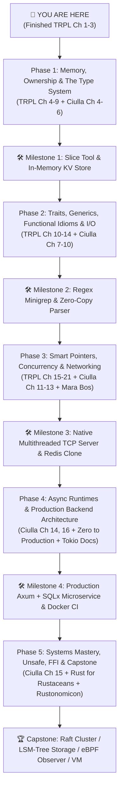

# 🦀 The Definitive Rust Mastery Roadmap: From Fundamentals to Senior Systems Engineer

> **Current Baseline:** Completed Chapters 1–3 of *The Rust Programming Language* (Variables, Mutability, Scopes & Shadowing, Scalar & Compound Types, Expressions vs. Statements, Control Flow, and Practice Exercises in [`practice/src/main.rs`](file:///home/bhondu/coding/rust/tute/rust_book/basics/practice/src/main.rs)).
>
> **Target Goal:** Become a highly respected, production-ready Rust engineer with a rock-solid mental model of memory, the borrow checker, type invariants, async runtimes, and systems architecture.

---

## 📚 Supporting Deep-Dive Modules

For granular chapter summaries, code diagrams, and architectural deep dives, refer to the dedicated reference files:

1. [**`01_official_rust_book_breakdown.md`**](file:///home/bhondu/coding/rust/notes/roadmap/01_official_rust_book_breakdown.md): Complete 21-chapter pedagogical breakdown of *The Rust Programming Language* (TRPL), compiler diagnostic literacy, and standard library mechanics.
2. [**`02_francesco_ciulla_handbook_breakdown.md`**](file:///home/bhondu/coding/rust/notes/roadmap/02_francesco_ciulla_handbook_breakdown.md): Deep-dive into Francesco Ciulla’s *The Rust Programming Handbook* (Packt 2025/2026), focusing on modern production tooling (Axum 0.8, SQLx, PostgreSQL, WebAssembly, Docker, and Linux Kernel modules).
3. [**`03_advanced_resources_and_mental_models.md`**](file:///home/bhondu/coding/rust/notes/roadmap/03_advanced_resources_and_mental_models.md): The 6 foundational mental models (Memory Layout, NLL/Borrowing, Dispatch, Concurrency/Atomics, Async Pinning, Error Architectures) and senior literature (*Rust for Rustaceans*, *Zero To Production*, *The Rustonomicon*, *Jon Gjengset's Crust of Rust*).
4. [**`04_milestone_projects_and_portfolio.md`**](file:///home/bhondu/coding/rust/notes/roadmap/04_milestone_projects_and_portfolio.md): 5-stage project curriculum with exact architectural specs, test suites, linter configurations, and portfolio capstones (Raft consensus, LSM-Tree DB, eBPF observer, Bytecode VM).
5. [**`05_yapbook_learning_bridge.md`**](file:///home/bhondu/coding/rust/notes/roadmap/05_yapbook_learning_bridge.md): Exact mapping between your Rust study topics and implementing your production features (P1–P12) in [**Yapbook**](file:///home/bhondu/coding/projects/yapbook).

---

## 🧭 The Unified Dual-Track Reading Strategy

Rather than reading one book and then the other in isolation, the most efficient path is a **Synergistic Dual-Track Strategy**:

```
                       THE DUAL-TRACK LEARNING ENGINE
┌─────────────────────────────────────────────────────────────────────────────┐
│ TRACK A: Theoretical & Mental Foundations                                   │
│ (The Official Rust Book + The Rust Reference)                               │
│  • Teaches *why* the compiler rejects code                                  │
│  • Builds zero-cost abstraction intuition                                  │
│  • Deep dive into standard library mechanics & ownership                    │
└──────────────────────────────────────┬──────────────────────────────────────┘
                                       │ Cross-pollination at each milestone
┌──────────────────────────────────────▼──────────────────────────────────────┐
│ TRACK B: Modern Industrial Tooling & Architecture                            │
│ (Francesco Ciulla's Handbook + Zero To Production)                          │
│  • Teaches *how* modern companies build and ship Rust (Axum, SQLx, Docker)  │
│  • Introduces production crates (`thiserror`, `anyhow`, `tracing`, `tokio`) │
│  • Real-world deployment, FFI, and WASM pipelines                           │
└─────────────────────────────────────────────────────────────────────────────┘
```

---

## 🗺️ The 5-Phase Journey to Rust Mastery



---

### Phase 1: Memory Semantics, Ownership & The Type System
**Duration Estimate:** 2–3 Weeks  
**Primary Sources:** TRPL Chapters 4, 5, 6, 7, 8, 9 ⟷ Ciulla Chapters 4, 5, 6.

#### Core Objectives:
1. **Conquer Chapter 4 (Ownership, Borrowing, Slices):**
   - Understand the difference between Stack frames and Heap allocations.
   - Master Move semantics vs. `Copy` (types implementing `Copy` must be bitwise duplicable without side effects).
   - The fundamental borrow rule: **At any given time, you can have either one mutable reference OR any number of immutable references, but never both** ($(\text{Shared} \land \text{Immutable}) \lor (\text{Exclusive} \land \text{Mutable})$).
   - String slices (`&str`) vs Heap Strings (`String`), array slices (`&[T]`) vs Vectors (`Vec<T>`).
2. **Structs & Enums (Chapters 5 & 6):**
   - Idiomatic method syntax (`&self`, `&mut self`, `self`).
   - Algebraic Data Types (ADTs): Enums with rich data payloads (`enum Message { Move { x: i32, y: i32 }, Write(String) }`).
   - `Option<T>` and `Result<T, E>` exhaustive pattern matching (`match`, `if let`, `let-else`).
3. **Module System & Collections (Chapters 7 & 8):**
   - Crates, packages, `pub(crate)` vs `pub` visibility, file hierarchy.
   - Vectors, Strings (UTF-8 bytes vs scalar values vs graphemes), and HashMaps (Entry API: `map.entry(k).or_insert(v)`).
4. **Modern Industrial Error Handling (TRPL Ch 9 + Ciulla Ch 6):**
   - Move beyond basic `unwrap()` and `expect()`.
   - Use the `?` operator for clean error propagation.
   - Learn the industry standard split:
     - **`thiserror`**: For strongly-typed domain & library errors.
     - **`anyhow`**: For application boundaries with contextual breadcrumbs (`.with_context(...)`).

#### Practical Exercises & Project:
- [ ] Complete all exercises in [**`04_milestone_projects_and_portfolio.md` — Project 1.1: `slice-tool`**](file:///home/bhondu/coding/rust/notes/roadmap/04_milestone_projects_and_portfolio.md#project-11-slice-tool--high-performance-zero-copy-text-utility).
- [ ] Build **`oxstore`** (Typed In-Memory KV Store with TTL and custom `thiserror` error types).
- [ ] Solve 15 exercises on the **Exercism Rust Track**.

---

### Phase 2: Traits, Generics, Functional Idioms & Robust I/O
**Duration Estimate:** 2–3 Weeks  
**Primary Sources:** TRPL Chapters 10, 11, 12, 13, 14 ⟷ Ciulla Chapters 7, 8, 9, 10.

#### Core Objectives:
1. **Generics, Traits & Lifetimes (TRPL Ch 10 + Ciulla Ch 7):**
   - Defining shared behavior via `trait`.
   - Trait bounds (`T: Display + Clone`, `where` clauses).
   - Static dispatch (Monomorphization: compile-time specialization) vs Dynamic dispatch (`&dyn Trait` / `Box<dyn Trait>` fat pointer with vtable).
   - **Lifetimes Syntax (`'a`):** Understand that lifetime annotations do not change how long a reference lives; they describe the relationship between multiple references to prevent dangling pointers.
   - Lifetime elision rules.
2. **Automated Testing & TDD (TRPL Ch 11 + Ciulla Ch 10):**
   - Unit tests (`#[test]`, `#[cfg(test)]`), integration tests (`tests/` directory), and doc tests (`///`).
   - Mocking and test doubles via trait substitution.
3. **I/O & Command-Line Architecture (TRPL Ch 12):**
   - Build `minigrep` separating `main.rs` (CLI parsing, process exit) from `lib.rs` (business logic, testable functions).
   - Streaming buffered reading (`std::io::BufReader`).
4. **Functional Rust: Iterators and Closures (TRPL Ch 13 + Ciulla Ch 9):**
   - Closures: `Fn`, `FnMut`, and `FnOnce` traits (how closures capture environment by ref, mut ref, or value).
   - Iterators: `iter()`, `iter_mut()`, and `into_iter()`.
   - Zero-cost iterator adapters: `map`, `filter`, `fold`, `flat_map`, `chain`, `zip`, `collect`.

#### Practical Exercises & Project:
- [ ] Build [**`minigrep-pro`**](file:///home/bhondu/coding/rust/notes/roadmap/04_milestone_projects_and_portfolio.md#project-21-minigrep-pro--industrial-regex-search-engine) with multi-file regex searching, colored outputs (`colored` crate), and recursive directory traversal.
- [ ] Implement a custom iterator (e.g., streaming CSV tokenizer).
- [ ] Build [**`micro-json`**](file:///home/bhondu/coding/rust/notes/roadmap/04_milestone_projects_and_portfolio.md#project-22-micro-json--zero-copy-parser-combinator-ast) using a parser combinator approach without external JSON crates.

---

### Phase 3: Smart Pointers, Concurrency & Multithreaded Systems
**Duration Estimate:** 3–4 Weeks  
**Primary Sources:** TRPL Chapters 15, 16, 17, 18, 19, 20/21 ⟷ Ciulla Chapters 11, 12, 13 ⟷ *Rust Atomics and Locks* (Mara Bos).

#### Core Objectives:
1. **Smart Pointers & Memory Management (TRPL Ch 15 + Ciulla Ch 11):**
   - `Box<T>`: Single unique heap allocation and recursive data structures.
   - `Deref` and `Drop` traits (Deref coercion and RAII cleanup).
   - `Rc<T>` (Reference counting for single-threaded multiple ownership) and `Arc<T>` (Atomic reference counting for multithreaded ownership).
   - **Interior Mutability Pattern:** `RefCell<T>` (borrow checking at runtime) and `Mutex<T>` / `RwLock<T>`.
   - Preventing memory leaks from reference cycles using `Weak<T>`.
2. **Fearless Concurrency (TRPL Ch 16 + Ciulla Ch 13):**
   - Spawning OS threads (`std::thread::spawn`) with `move` closures.
   - Message passing concurrency: `std::sync::mpsc` channels vs `crossbeam-channel`.
   - Shared-state concurrency: Wrapping state in `Arc<Mutex<T>>`.
   - The cornerstone auto-traits:
     - `Send`: Safe to transfer ownership across thread boundaries.
     - `Sync`: Safe to share references (`&T`) across thread boundaries ($T: \text{Sync} \iff \&T: \text{Send}$).
3. **Capstone Web Server (TRPL Ch 20/21 + Ciulla Ch 12):**
   - Build the multithreaded TCP HTTP server from scratch.
   - Implement a custom threadpool with worker threads, job channels, and graceful shutdown on `SIGINT`/`Drop`.

#### Practical Exercises & Project:
- [ ] Build [**`ferris-server`**](file:///home/bhondu/coding/rust/notes/roadmap/04_milestone_projects_and_portfolio.md#project-31-ferris-server--native-http11-server-with-custom-threadpool): HTTP/1.1 static file & API server with thread pool, request parsing, and rate limiting.
- [ ] Build [**`rusty-redis`**](file:///home/bhondu/coding/rust/notes/roadmap/04_milestone_projects_and_portfolio.md#project-33-rusty-redis--in-memory-database-with-resp-protocol): A standalone Redis server implementing the RESP protocol, lock-striped key-value storage, and multi-client TCP handling.
- [ ] Watch Jon Gjengset's *Crust of Rust* episodes on `Channels`, `Smart Pointers`, and `Atomics`.

---

### Phase 4: Async Runtimes, Production Web Backends & DevOps
**Duration Estimate:** 3–4 Weeks  
**Primary Sources:** Ciulla Chapters 14, 16 ⟷ *Zero To Production In Rust* (Luca Palmieri) ⟷ Official Tokio Tutorial.

#### Core Objectives:
1. **The Asynchronous Rust Mental Model:**
   - How `async fn` desugars into a state machine enum generated by the compiler.
   - The pull-based polling model: `Future::poll(Pin<&mut Self>, &mut Context<'_>) -> Poll<Output>`.
   - Why `Pin` is required to guarantee memory stability for self-referential futures.
   - Cooperative scheduling: Never execute CPU-heavy blocking operations inside async worker threads without `tokio::task::spawn_blocking`.
2. **Modern Web Backend with Axum 0.8 & SQLx (Ciulla Ch 14):**
   - Routing, Extractors (`Json`, `Path`, `Query`, `State`), and Middleware (Tower service stack).
   - Compile-time checked SQL queries with `sqlx::query!` and PostgreSQL connection pooling (`sqlx::PgPool`).
   - Authentication (JWT / Argon2 password hashing / Session management).
   - Structured observability with `tracing` (spans, events, JSON formatter for log aggregators).
3. **Containerization & Production Deployment (Ciulla Ch 16):**
   - Multi-stage `Dockerfile` with dependency build layer caching (using `cargo-chef`).
   - Static binary compilation with `musl` on Alpine or Google Distroless containers (sub-15MB images).
   - Binary optimization: `cargo build --release`, `strip`, and LTO (`lto = true`, `codegen-units = 1`).
   - Multi-container orchestration with `docker-compose.yml` (App + PostgreSQL + Redis).

#### Practical Exercises & Project:
- [ ] Complete [**`nexus-api`**](file:///home/bhondu/coding/rust/notes/roadmap/04_milestone_projects_and_portfolio.md#project-41-nexus-api--enterprise-async-microservice-stack): Production REST microservice with user registration, authentication, database migrations, structured tracing, and full Docker Compose deployment.
- [ ] Implement a WebAssembly browser widget using `wasm-bindgen` (Ciulla Ch 14).

---

### Phase 5: Advanced Systems, Unsafe Rust, FFI & Capstone Mastery
**Duration Estimate:** 4+ Weeks  
**Primary Sources:** Ciulla Chapter 15 ⟷ *Rust for Rustaceans* (Jon Gjengset) ⟷ *The Rustonomicon*.

#### Core Objectives:
1. **Unsafe Rust & The Dark Arts (TRPL Ch 19 + Ciulla Ch 15 + Rustonomicon):**
   - Dereferencing raw pointers (`*const T`, `*mut T`).
   - The `unsafe` keyword contract: Programmer assumes responsibility for upholding compiler invariants (no undefined behavior, proper alignment, no null derefs, no data races).
   - Safe abstraction layers: Wrapping unsafe blocks in mathematically verified safe public APIs.
   - Running **Miri** (`cargo miri test`) to detect undefined behavior, memory leaks, and invalid aliasing.
2. **Foreign Function Interface (FFI):**
   - Interfacing C libraries with Rust via `extern "C"` and `bindgen`.
   - Exporting Rust libraries to C (`#[no_mangle]`, `extern "C"`).
   - Memory ownership across language boundaries (passing C strings, custom allocators).
3. **Advanced Trait Patterns & Ergonomics (*Rust for Rustaceans*):**
   - Marker traits and Phantom Types (`PhantomData<T>`).
   - The Typestate Pattern: Encoding state machine transitions at compile time to make invalid states unrepresentable.
   - Associated types vs generic parameters, Higher-Ranked Trait Bounds (`for<'a>`).

#### Capstone Project (Choose One for Your Portfolio):
- [ ] **Option A: `raft-rs`** — Distributed consensus algorithm implementing leader election, log replication, and heartbeat timers.
- [ ] **Option B: `pebble-db`** — Log-Structured Merge-tree (LSM-Tree) embedded key-value storage engine with Write-Ahead Log (WAL), MemTable, and SSTables.
- [ ] **Option C: `sys-observer`** — Linux eBPF / C-FFI performance telemetry daemon collecting kernel network/disk metrics.
- [ ] **Option D: `vanguard-vm`** — Bytecode compiler and register/stack VM with a mark-and-sweep garbage collector.

---

## 🧠 The 6 Invariant Mental Models for Senior Rust Engineers

| # | Mental Model | Key Principle to Internalize |
| :--- | :--- | :--- |
| **1** | **Physical Memory Layout** | Know the exact byte layout of every type on the stack and heap. Thin pointers (8B) vs Fat pointers (16B for `&[T]`, `&str`, `&dyn Trait`). Understand padding and alignment. |
| **2** | **The Aliasing XOR Mutability Rule** | Memory can be aliased (shared) OR mutated (exclusive), NEVER both simultaneously. This single rule eliminates data races, iterator invalidation, and memory bugs at compile time. |
| **3** | **Non-Lexical Lifetimes (NLL)** | Lifetimes are not lexical scopes (`{}`); they are precise control-flow liveness ranges analyzed by the borrow checker's borrow-graph engine. |
| **4** | **Static vs Dynamic Dispatch** | Generics monomorphize (zero runtime cost, inlined code, larger binary size). Trait objects (`dyn Trait`) use fat pointers with a vtable (dynamic dispatch, smaller binary, indirect function call overhead). |
| **5** | **Async as State Machines** | `async` does not spawn hidden background threads. Futures are passive data structures that do nothing until `.await` or `poll()` is invoked. `Pin` guarantees self-referential pointer stability. |
| **6** | **Industrial Error Separation** | Use `thiserror` to define structured, exhaustive enums for library code; use `anyhow` with `.context()` for rich, backtraced reporting in top-level applications. |

---

## 🛠️ The Professional Rust Tooling Arsenal

Ensure your development environment has these essential tools installed:

```bash
# 1. Official Linters, Formatters & Checkers
rustup component add clippy rustfmt

# 2. Memory Sanitization & UB Detector
rustup component add miri

# 3. Cargo Productivity Extensions
cargo install cargo-watch      # Automatic rebuilds on file change (cargo watch -x check -x test)
cargo install cargo-expand     # Inspect macro and desugaring expansions
cargo install cargo-audit      # Scan dependencies for known security vulnerabilities
cargo install cargo-deny       # Enforce crate licenses, banned dependencies, and security
cargo install cargo-tarpaulin  # Code coverage report generation
cargo install cargo-nextest    # Next-generation high-speed parallel test runner
cargo install cargo-chef       # Fast Docker layer caching for Rust dependencies
```

---

## 📅 Recommended Weekly Execution Schedule

```
┌─────────────────────────────────────────────────────────────────────────────┐
│ MON - THU : Deep Reading & Note Taking (1-2 Hours/day)                      │
│             • Read TRPL chapter -> Cross-reference corresponding Ciulla Ch  │
│             • Add mental model summaries to notes/                          │
│                                                                             │
│ FRI       : Exercise Drills (1-2 Hours)                                     │
│             • Complete Rustlings or Exercism problem sets for that topic    │
│                                                                             │
│ SAT - SUN : Milestone Project Building (3-5 Hours)                          │
│             • Implement the phase project in a standalone repository        │
│             • Write comprehensive unit + integration tests                  │
│             • Run `cargo clippy -- -D warnings` and `cargo fmt`             │
└─────────────────────────────────────────────────────────────────────────────┘
```

---

## 🚀 Immediate Next Steps (Starting Today)

1. **Step 1:** Open [**Chapter 4 of The Rust Book**](file:///home/bhondu/.rustup/toolchains/stable-x86_64-unknown-linux-gnu/share/doc/rust/html/book/ch04-00-understanding-ownership.html) and read Sections 4.1 (What is Ownership?), 4.2 (References and Borrowing), and 4.3 (Slice Type).
2. **Step 2:** Cross-read [**Chapter 4 of Francesco Ciulla's Handbook**](file:///home/bhondu/coding/rust/notes/roadmap/02_francesco_ciulla_handbook_breakdown.md#chapter-4-ownership-borrowing-and-references) to see practical move vs. borrow patterns.
3. **Step 3:** Review the detailed breakdown in [**`01_official_rust_book_breakdown.md`**](file:///home/bhondu/coding/rust/notes/roadmap/01_official_rust_book_breakdown.md#phase-2-the-core-mental-model-of-rust-chapters-4--6) for ownership traps and memory diagrams.
4. **Step 4:** Initialize your first practice project:
   ```bash
   cargo new --bin slice_tool
   ```
   Implement the requirements specified in [**`04_milestone_projects_and_portfolio.md` — Project 1.1**](file:///home/bhondu/coding/rust/notes/roadmap/04_milestone_projects_and_portfolio.md#project-11-slice-tool--high-performance-zero-copy-text-utility).
