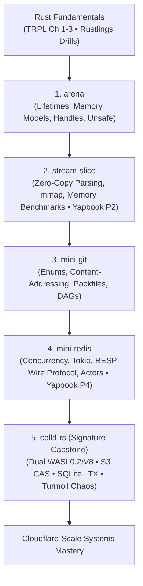

# The Definitive Rust Mastery Roadmap: From Fundamentals to Senior Systems Engineer

> **Core Philosophy: Problem-First Discovery**  
> Instead of *"Learn Chapter X -> Build Project Y"*, encounter real systems bottlenecks and discover the exact Rust language features engineered to solve them.
>
> **Target Engineering Level:** Distributed systems, edge infrastructure, and cloud-native storage (Cloudflare, Fastly, Deno, Cursor style).

---

## Supporting Deep-Dive Modules

1. [**`01_official_rust_book_breakdown.md`**](file:///home/bhondu/coding/rust/notes/roadmap/01_official_rust_book_breakdown.md): Complete 21-chapter pedagogical breakdown of *The Rust Programming Language* (TRPL), compiler diagnostic literacy, and standard library mechanics.
2. [**`02_francesco_ciulla_handbook_breakdown.md`**](file:///home/bhondu/coding/rust/notes/roadmap/02_francesco_ciulla_handbook_breakdown.md): Deep-dive into Francesco Ciulla’s *The Rust Programming Handbook*, focusing on modern production tooling (Axum 0.8, SQLx, PostgreSQL, WebAssembly, Docker, and Linux Kernel modules).
3. [**`03_advanced_resources_and_mental_models.md`**](file:///home/bhondu/coding/rust/notes/roadmap/03_advanced_resources_and_mental_models.md): The 6 foundational mental models (Memory Layout, NLL/Borrowing, Dispatch, Concurrency/Atomics, Async Pinning, Error Architectures) and senior literature (*Rust for Rustaceans*, *Zero To Production*, *The Rustonomicon*, *Jon Gjengset's Crust of Rust*).
4. [**`04_milestone_projects_and_portfolio.md`**](file:///home/bhondu/coding/rust/notes/roadmap/04_milestone_projects_and_portfolio.md): The Elite 5-Project Systems Stack (`arena`, `stream-slice`, `mini-git`, `mini-redis`, `celld-rs` with 5 standout capabilities).
5. [**`05_yapbook_learning_bridge.md`**](file:///home/bhondu/coding/rust/notes/roadmap/05_yapbook_learning_bridge.md): Exact mapping between your Rust study topics and implementing production features (P1–P12) in [**Yapbook**](file:///home/bhondu/coding/projects/yapbook).

---

## Problem-First Discovery Engine

```
Why can't I return this reference?           --> Lifetimes & Arena Handles
Why can't these two threads mutate this?     --> Send + Sync & Arc<Mutex<T>>
Why does this future need Pin?               --> Self-referential generator state stability
Why does this filesystem need unsafe?        --> FFI, raw pointers & C-ABI contracts
Why is memory/copying killing throughput?    --> Borrowing & zero-copy slicing
Why does this concurrent server deadlock?    --> Ownership & RAII lock scopes
How to build stateful edge actors on S3?     --> CAS Leases & SQLite LTX Replication
```

---

## The Elite 5-Project Systems Stack



---

## Granular Project Mapping

| Step | Project | Core Rust Lesson | Systems Layer & Standout Differentiator |
| :--- | :--- | :--- | :--- |
| **1** | **`arena`** | Lifetimes, reference graphs, `Vec` handles, `NonNull<T>`, unsafe | **Memory Layer:** Zero-fragmentation generational arena allocator |
| **2** | **`stream-slice`** | Zero-copy slicing, `&[u8]`, `memmap2`, allocation profiling | **Ingestion Layer:** 126k log parsing with $< 10	ext{ MB}$ RSS, zero hot-loop allocations |
| **3** | **`mini-git`** | Enums, traits, filesystem I/O, content-addressing, packfiles | **Storage Layer:** Git object DAG, SHA-256 hashing, delta compression |
| **4** | **`mini-redis`** | Concurrency, Tokio event loop, RESP wire protocol, actors | **Networking Layer:** High-concurrency async TCP gateway with backpressure |
| **5** | **`celld-rs`** | Distributed state, S3 CAS leases, SQLite LTX, Wasmtime | **Distributed State Layer:** Self-hosted Cloudflare Durable Objects with Dual WASI 0.2/V8 runtime, Turmoil chaos suite, in-cell vector search, and sub-10ms pipelined commits |

---

## Weekly Allocation Strategy

- **Monday to Thursday (1 to 2 Hours / Day):** Theoretical reading (TRPL & Ciulla Handbook chapters), concept notes, learning records, glossary expansion.
- **Friday to Sunday (3 to 5 Hours / Day):** Hands-on implementation sessions. Solve Rustlings problem sets, build project stack crates, and implement Yapbook production features.
